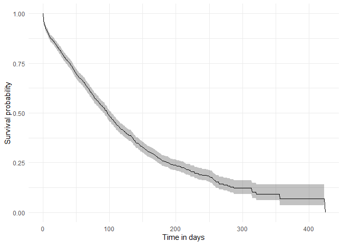
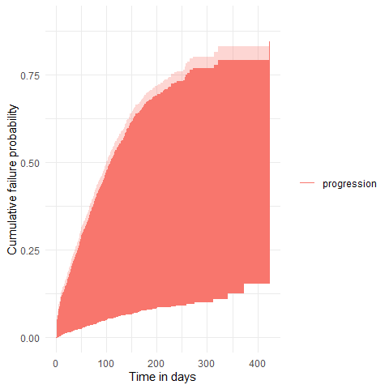
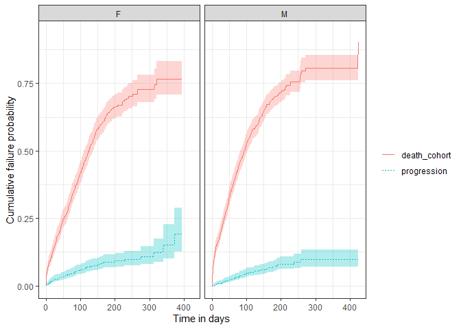

<!-- README.md is generated from README.Rmd. Please edit that file -->

# CohortSurvival <a href="https://darwin-eu-dev.github.io/CohortSurvival/"></a>

[](https://CRAN.R-project.org/package=CohortSurvival)
[](https://app.codecov.io/github/darwin-eu/CohortSurvival?branch=main)
[](https://github.com/darwin-eu/CohortSurvival/actions)
[](https://lifecycle.r-lib.org/articles/stages.html)

CohortSurvival contains functions for extracting and summarising
survival data using the OMOP common data model.

## Installation

You can install CohortSurvival like so:

``` r
install.packages("CohortSurvival")
```

## Example usage

### Create a reference to data in the OMOP CDM format

The CohortSurvival package is designed to work with data in the OMOP CDM
format, so our first step is to create a reference to the data using the
CDMConnector package.

For this example we´ll use a cdm reference containing the MGUS2 dataset
from the survival package (which we transformed into a set of OMOP CDM
style cohort tables). The MGUS2 dataset contains survival data of 1341
sequential patients with monoclonal gammopathy of undetermined
significance (MGUS). For more information see `?survival::mgus2`.

``` r
library(CDMConnector)
library(CohortSurvival)
library(dplyr)
library(ggplot2)

cdm <- CohortSurvival::mockMGUS2cdm()
```

In our cdm reference we have three cohort tables of interest: 1) MGUS
diagnosis cohort

``` r
cdm$mgus_diagnosis %>%
  glimpse()
#> Rows: ??
#> Columns: 10
#> Database: DuckDB v1.1.3 [lopezk@Windows 10 x64:R 4.3.2/:memory:]
#> $ cohort_definition_id <int> 1, 1, 1, 1, 1, 1, 1, 1, 1, 1, 1, 1, 1, 1, 1, 1, 1…
#> $ subject_id           <int> 1, 2, 3, 4, 5, 6, 7, 8, 9, 10, 11, 12, 13, 14, 15…
#> $ cohort_start_date    <date> 1981-01-01, 1968-01-01, 1980-01-01, 1977-01-01, …
#> $ cohort_end_date      <date> 1981-01-01, 1968-01-01, 1980-01-01, 1977-01-01, …
#> $ age                  <dbl> 88, 78, 94, 68, 90, 90, 89, 87, 86, 79, 86, 89, 8…
#> $ sex                  <fct> F, F, M, M, F, M, F, F, F, F, M, F, M, F, M, F, F…
#> $ hgb                  <dbl> 13.1, 11.5, 10.5, 15.2, 10.7, 12.9, 10.5, 12.3, 1…
#> $ creat                <dbl> 1.30, 1.20, 1.50, 1.20, 0.80, 1.00, 0.90, 1.20, 0…
#> $ mspike               <dbl> 0.5, 2.0, 2.6, 1.2, 1.0, 0.5, 1.3, 1.6, 2.4, 2.3,…
#> $ age_group            <chr> ">=70", ">=70", ">=70", "<70", ">=70", ">=70", ">…
```

2)  MGUS progression to multiple myeloma cohort

``` r
cdm$progression %>%
  glimpse()
#> Rows: ??
#> Columns: 4
#> Database: DuckDB v1.1.3 [lopezk@Windows 10 x64:R 4.3.2/:memory:]
#> $ cohort_definition_id <int> 1, 1, 1, 1, 1, 1, 1, 1, 1, 1, 1, 1, 1, 1, 1, 1, 1…
#> $ subject_id           <int> 56, 81, 83, 111, 124, 127, 147, 163, 165, 167, 18…
#> $ cohort_start_date    <date> 1978-01-30, 1985-01-15, 1974-08-17, 1993-01-14, …
#> $ cohort_end_date      <date> 1978-01-30, 1985-01-15, 1974-08-17, 1993-01-14, …
```

3)  Death cohort

``` r
cdm$death_cohort %>%
  glimpse()
#> Rows: ??
#> Columns: 4
#> Database: DuckDB v1.1.3 [lopezk@Windows 10 x64:R 4.3.2/:memory:]
#> $ cohort_definition_id <int> 1, 1, 1, 1, 1, 1, 1, 1, 1, 1, 1, 1, 1, 1, 1, 1, 1…
#> $ subject_id           <int> 1, 2, 3, 4, 5, 6, 7, 8, 10, 11, 12, 13, 14, 15, 1…
#> $ cohort_start_date    <date> 1981-01-31, 1968-01-26, 1980-02-16, 1977-04-03, …
#> $ cohort_end_date      <date> 1981-01-31, 1968-01-26, 1980-02-16, 1977-04-03, …
```

### MGUS diagnosis to death

We can get survival estimates for death following MGUS diagnosis like
so:

``` r
MGUS_death <- estimateSingleEventSurvival(cdm,
  targetCohortTable = "mgus_diagnosis",
  outcomeCohortTable = "death_cohort"
)
MGUS_death %>% 
  glimpse()
#> Rows: 1,354
#> Columns: 13
#> $ result_id        <int> 1, 1, 1, 1, 1, 1, 1, 1, 1, 1, 1, 1, 1, 1, 1, 1, 1, 1,…
#> $ cdm_name         <chr> "mock", "mock", "mock", "mock", "mock", "mock", "mock…
#> $ group_name       <chr> "target_cohort", "target_cohort", "target_cohort", "t…
#> $ group_level      <chr> "mgus_diagnosis", "mgus_diagnosis", "mgus_diagnosis",…
#> $ strata_name      <chr> "overall", "overall", "overall", "overall", "overall"…
#> $ strata_level     <chr> "overall", "overall", "overall", "overall", "overall"…
#> $ variable_name    <chr> "outcome", "outcome", "outcome", "outcome", "outcome"…
#> $ variable_level   <chr> "death_cohort", "death_cohort", "death_cohort", "deat…
#> $ estimate_name    <chr> "estimate", "estimate_95CI_lower", "estimate_95CI_upp…
#> $ estimate_type    <chr> "numeric", "numeric", "numeric", "numeric", "numeric"…
#> $ estimate_value   <chr> "1", "1", "1", "0.9697", "0.9607", "0.9787", "0.9494"…
#> $ additional_name  <chr> "time", "time", "time", "time", "time", "time", "time…
#> $ additional_level <chr> "0", "0", "0", "1", "1", "1", "2", "2", "2", "3", "3"…
```

Now that we have our results, we can quickly create a plot summarising
survival over time.

``` r
plotSurvival(MGUS_death)
```



Among others, we can check the survival summary of our target and
outcome cohorts of interest:

``` r
tableSurvival(MGUS_death, times = c(30,60,180))
```

<div id="ueualcaxii" style="padding-left:0px;padding-right:0px;padding-top:10px;padding-bottom:10px;overflow-x:auto;overflow-y:auto;width:auto;height:auto;">
<style>#ueualcaxii table {
  font-family: system-ui, 'Segoe UI', Roboto, Helvetica, Arial, sans-serif, 'Apple Color Emoji', 'Segoe UI Emoji', 'Segoe UI Symbol', 'Noto Color Emoji';
  -webkit-font-smoothing: antialiased;
  -moz-osx-font-smoothing: grayscale;
}
&#10;#ueualcaxii thead, #ueualcaxii tbody, #ueualcaxii tfoot, #ueualcaxii tr, #ueualcaxii td, #ueualcaxii th {
  border-style: none;
}
&#10;#ueualcaxii p {
  margin: 0;
  padding: 0;
}
&#10;#ueualcaxii .gt_table {
  display: table;
  border-collapse: collapse;
  line-height: normal;
  margin-left: auto;
  margin-right: auto;
  color: #333333;
  font-size: 16px;
  font-weight: normal;
  font-style: normal;
  background-color: #FFFFFF;
  width: auto;
  border-top-style: solid;
  border-top-width: 2px;
  border-top-color: #A8A8A8;
  border-right-style: none;
  border-right-width: 2px;
  border-right-color: #D3D3D3;
  border-bottom-style: solid;
  border-bottom-width: 2px;
  border-bottom-color: #A8A8A8;
  border-left-style: none;
  border-left-width: 2px;
  border-left-color: #D3D3D3;
}
&#10;#ueualcaxii .gt_caption {
  padding-top: 4px;
  padding-bottom: 4px;
}
&#10;#ueualcaxii .gt_title {
  color: #333333;
  font-size: 125%;
  font-weight: initial;
  padding-top: 4px;
  padding-bottom: 4px;
  padding-left: 5px;
  padding-right: 5px;
  border-bottom-color: #FFFFFF;
  border-bottom-width: 0;
}
&#10;#ueualcaxii .gt_subtitle {
  color: #333333;
  font-size: 85%;
  font-weight: initial;
  padding-top: 3px;
  padding-bottom: 5px;
  padding-left: 5px;
  padding-right: 5px;
  border-top-color: #FFFFFF;
  border-top-width: 0;
}
&#10;#ueualcaxii .gt_heading {
  background-color: #FFFFFF;
  text-align: center;
  border-bottom-color: #FFFFFF;
  border-left-style: none;
  border-left-width: 1px;
  border-left-color: #D3D3D3;
  border-right-style: none;
  border-right-width: 1px;
  border-right-color: #D3D3D3;
}
&#10;#ueualcaxii .gt_bottom_border {
  border-bottom-style: solid;
  border-bottom-width: 2px;
  border-bottom-color: #D3D3D3;
}
&#10;#ueualcaxii .gt_col_headings {
  border-top-style: solid;
  border-top-width: 2px;
  border-top-color: #D3D3D3;
  border-bottom-style: solid;
  border-bottom-width: 2px;
  border-bottom-color: #D3D3D3;
  border-left-style: none;
  border-left-width: 1px;
  border-left-color: #D3D3D3;
  border-right-style: none;
  border-right-width: 1px;
  border-right-color: #D3D3D3;
}
&#10;#ueualcaxii .gt_col_heading {
  color: #333333;
  background-color: #FFFFFF;
  font-size: 100%;
  font-weight: normal;
  text-transform: inherit;
  border-left-style: none;
  border-left-width: 1px;
  border-left-color: #D3D3D3;
  border-right-style: none;
  border-right-width: 1px;
  border-right-color: #D3D3D3;
  vertical-align: bottom;
  padding-top: 5px;
  padding-bottom: 6px;
  padding-left: 5px;
  padding-right: 5px;
  overflow-x: hidden;
}
&#10;#ueualcaxii .gt_column_spanner_outer {
  color: #333333;
  background-color: #FFFFFF;
  font-size: 100%;
  font-weight: normal;
  text-transform: inherit;
  padding-top: 0;
  padding-bottom: 0;
  padding-left: 4px;
  padding-right: 4px;
}
&#10;#ueualcaxii .gt_column_spanner_outer:first-child {
  padding-left: 0;
}
&#10;#ueualcaxii .gt_column_spanner_outer:last-child {
  padding-right: 0;
}
&#10;#ueualcaxii .gt_column_spanner {
  border-bottom-style: solid;
  border-bottom-width: 2px;
  border-bottom-color: #D3D3D3;
  vertical-align: bottom;
  padding-top: 5px;
  padding-bottom: 5px;
  overflow-x: hidden;
  display: inline-block;
  width: 100%;
}
&#10;#ueualcaxii .gt_spanner_row {
  border-bottom-style: hidden;
}
&#10;#ueualcaxii .gt_group_heading {
  padding-top: 8px;
  padding-bottom: 8px;
  padding-left: 5px;
  padding-right: 5px;
  color: #333333;
  background-color: #FFFFFF;
  font-size: 100%;
  font-weight: initial;
  text-transform: inherit;
  border-top-style: solid;
  border-top-width: 2px;
  border-top-color: #D3D3D3;
  border-bottom-style: solid;
  border-bottom-width: 2px;
  border-bottom-color: #D3D3D3;
  border-left-style: none;
  border-left-width: 1px;
  border-left-color: #D3D3D3;
  border-right-style: none;
  border-right-width: 1px;
  border-right-color: #D3D3D3;
  vertical-align: middle;
  text-align: left;
}
&#10;#ueualcaxii .gt_empty_group_heading {
  padding: 0.5px;
  color: #333333;
  background-color: #FFFFFF;
  font-size: 100%;
  font-weight: initial;
  border-top-style: solid;
  border-top-width: 2px;
  border-top-color: #D3D3D3;
  border-bottom-style: solid;
  border-bottom-width: 2px;
  border-bottom-color: #D3D3D3;
  vertical-align: middle;
}
&#10;#ueualcaxii .gt_from_md > :first-child {
  margin-top: 0;
}
&#10;#ueualcaxii .gt_from_md > :last-child {
  margin-bottom: 0;
}
&#10;#ueualcaxii .gt_row {
  padding-top: 8px;
  padding-bottom: 8px;
  padding-left: 5px;
  padding-right: 5px;
  margin: 10px;
  border-top-style: solid;
  border-top-width: 1px;
  border-top-color: #D3D3D3;
  border-left-style: none;
  border-left-width: 1px;
  border-left-color: #D3D3D3;
  border-right-style: none;
  border-right-width: 1px;
  border-right-color: #D3D3D3;
  vertical-align: middle;
  overflow-x: hidden;
}
&#10;#ueualcaxii .gt_stub {
  color: #333333;
  background-color: #FFFFFF;
  font-size: 100%;
  font-weight: initial;
  text-transform: inherit;
  border-right-style: solid;
  border-right-width: 2px;
  border-right-color: #D3D3D3;
  padding-left: 5px;
  padding-right: 5px;
}
&#10;#ueualcaxii .gt_stub_row_group {
  color: #333333;
  background-color: #FFFFFF;
  font-size: 100%;
  font-weight: initial;
  text-transform: inherit;
  border-right-style: solid;
  border-right-width: 2px;
  border-right-color: #D3D3D3;
  padding-left: 5px;
  padding-right: 5px;
  vertical-align: top;
}
&#10;#ueualcaxii .gt_row_group_first td {
  border-top-width: 2px;
}
&#10;#ueualcaxii .gt_row_group_first th {
  border-top-width: 2px;
}
&#10;#ueualcaxii .gt_summary_row {
  color: #333333;
  background-color: #FFFFFF;
  text-transform: inherit;
  padding-top: 8px;
  padding-bottom: 8px;
  padding-left: 5px;
  padding-right: 5px;
}
&#10;#ueualcaxii .gt_first_summary_row {
  border-top-style: solid;
  border-top-color: #D3D3D3;
}
&#10;#ueualcaxii .gt_first_summary_row.thick {
  border-top-width: 2px;
}
&#10;#ueualcaxii .gt_last_summary_row {
  padding-top: 8px;
  padding-bottom: 8px;
  padding-left: 5px;
  padding-right: 5px;
  border-bottom-style: solid;
  border-bottom-width: 2px;
  border-bottom-color: #D3D3D3;
}
&#10;#ueualcaxii .gt_grand_summary_row {
  color: #333333;
  background-color: #FFFFFF;
  text-transform: inherit;
  padding-top: 8px;
  padding-bottom: 8px;
  padding-left: 5px;
  padding-right: 5px;
}
&#10;#ueualcaxii .gt_first_grand_summary_row {
  padding-top: 8px;
  padding-bottom: 8px;
  padding-left: 5px;
  padding-right: 5px;
  border-top-style: double;
  border-top-width: 6px;
  border-top-color: #D3D3D3;
}
&#10;#ueualcaxii .gt_last_grand_summary_row_top {
  padding-top: 8px;
  padding-bottom: 8px;
  padding-left: 5px;
  padding-right: 5px;
  border-bottom-style: double;
  border-bottom-width: 6px;
  border-bottom-color: #D3D3D3;
}
&#10;#ueualcaxii .gt_striped {
  background-color: rgba(128, 128, 128, 0.05);
}
&#10;#ueualcaxii .gt_table_body {
  border-top-style: solid;
  border-top-width: 2px;
  border-top-color: #D3D3D3;
  border-bottom-style: solid;
  border-bottom-width: 2px;
  border-bottom-color: #D3D3D3;
}
&#10;#ueualcaxii .gt_footnotes {
  color: #333333;
  background-color: #FFFFFF;
  border-bottom-style: none;
  border-bottom-width: 2px;
  border-bottom-color: #D3D3D3;
  border-left-style: none;
  border-left-width: 2px;
  border-left-color: #D3D3D3;
  border-right-style: none;
  border-right-width: 2px;
  border-right-color: #D3D3D3;
}
&#10;#ueualcaxii .gt_footnote {
  margin: 0px;
  font-size: 90%;
  padding-top: 4px;
  padding-bottom: 4px;
  padding-left: 5px;
  padding-right: 5px;
}
&#10;#ueualcaxii .gt_sourcenotes {
  color: #333333;
  background-color: #FFFFFF;
  border-bottom-style: none;
  border-bottom-width: 2px;
  border-bottom-color: #D3D3D3;
  border-left-style: none;
  border-left-width: 2px;
  border-left-color: #D3D3D3;
  border-right-style: none;
  border-right-width: 2px;
  border-right-color: #D3D3D3;
}
&#10;#ueualcaxii .gt_sourcenote {
  font-size: 90%;
  padding-top: 4px;
  padding-bottom: 4px;
  padding-left: 5px;
  padding-right: 5px;
}
&#10;#ueualcaxii .gt_left {
  text-align: left;
}
&#10;#ueualcaxii .gt_center {
  text-align: center;
}
&#10;#ueualcaxii .gt_right {
  text-align: right;
  font-variant-numeric: tabular-nums;
}
&#10;#ueualcaxii .gt_font_normal {
  font-weight: normal;
}
&#10;#ueualcaxii .gt_font_bold {
  font-weight: bold;
}
&#10;#ueualcaxii .gt_font_italic {
  font-style: italic;
}
&#10;#ueualcaxii .gt_super {
  font-size: 65%;
}
&#10;#ueualcaxii .gt_footnote_marks {
  font-size: 75%;
  vertical-align: 0.4em;
  position: initial;
}
&#10;#ueualcaxii .gt_asterisk {
  font-size: 100%;
  vertical-align: 0;
}
&#10;#ueualcaxii .gt_indent_1 {
  text-indent: 5px;
}
&#10;#ueualcaxii .gt_indent_2 {
  text-indent: 10px;
}
&#10;#ueualcaxii .gt_indent_3 {
  text-indent: 15px;
}
&#10;#ueualcaxii .gt_indent_4 {
  text-indent: 20px;
}
&#10;#ueualcaxii .gt_indent_5 {
  text-indent: 25px;
}
&#10;#ueualcaxii .katex-display {
  display: inline-flex !important;
  margin-bottom: 0.75em !important;
}
&#10;#ueualcaxii div.Reactable > div.rt-table > div.rt-thead > div.rt-tr.rt-tr-group-header > div.rt-th-group:after {
  height: 0px !important;
}
</style>
<table class="gt_table" data-quarto-disable-processing="false" data-quarto-bootstrap="false">
  <thead>
    <tr class="gt_col_headings gt_spanner_row">
      <th class="gt_col_heading gt_columns_bottom_border gt_left" rowspan="2" colspan="1" style="text-align: center; font-weight: bold;" scope="col" id="CDM-name">CDM name</th>
      <th class="gt_col_heading gt_columns_bottom_border gt_left" rowspan="2" colspan="1" style="text-align: center; font-weight: bold;" scope="col" id="Target-cohort">Target cohort</th>
      <th class="gt_col_heading gt_columns_bottom_border gt_left" rowspan="2" colspan="1" style="text-align: center; font-weight: bold;" scope="col" id="Outcome-name">Outcome name</th>
      <th class="gt_center gt_columns_top_border gt_column_spanner_outer" rowspan="1" colspan="7" style="background-color: #D9D9D9; text-align: center; font-weight: bold;" scope="colgroup" id="spanner-[header_name]Estimate name&#10;[header_level]Number records">
        <div class="gt_column_spanner">Estimate name</div>
      </th>
    </tr>
    <tr class="gt_col_headings">
      <th class="gt_col_heading gt_columns_bottom_border gt_right" rowspan="1" colspan="1" style="background-color: #E1E1E1; text-align: center; font-weight: bold;" scope="col" id="[header_name]Estimate-name-[header_level]Number-records">Number records</th>
      <th class="gt_col_heading gt_columns_bottom_border gt_right" rowspan="1" colspan="1" style="background-color: #E1E1E1; text-align: center; font-weight: bold;" scope="col" id="[header_name]Estimate-name-[header_level]Number-events">Number events</th>
      <th class="gt_col_heading gt_columns_bottom_border gt_right" rowspan="1" colspan="1" style="background-color: #E1E1E1; text-align: center; font-weight: bold;" scope="col" id="[header_name]Estimate-name-[header_level]Median-survival-(95%-CI)">Median survival (95% CI)</th>
      <th class="gt_col_heading gt_columns_bottom_border gt_right" rowspan="1" colspan="1" style="background-color: #E1E1E1; text-align: center; font-weight: bold;" scope="col" id="[header_name]Estimate-name-[header_level]Restricted-mean-survival-(SE)">Restricted mean survival (SE)</th>
      <th class="gt_col_heading gt_columns_bottom_border gt_right" rowspan="1" colspan="1" style="background-color: #E1E1E1; text-align: center; font-weight: bold;" scope="col" id="[header_name]Estimate-name-[header_level]30-days-survival-estimate">30 days survival estimate</th>
      <th class="gt_col_heading gt_columns_bottom_border gt_right" rowspan="1" colspan="1" style="background-color: #E1E1E1; text-align: center; font-weight: bold;" scope="col" id="[header_name]Estimate-name-[header_level]60-days-survival-estimate">60 days survival estimate</th>
      <th class="gt_col_heading gt_columns_bottom_border gt_right" rowspan="1" colspan="1" style="background-color: #E1E1E1; text-align: center; font-weight: bold;" scope="col" id="[header_name]Estimate-name-[header_level]180-days-survival-estimate">180 days survival estimate</th>
    </tr>
  </thead>
  <tbody class="gt_table_body">
    <tr><td headers="CDM name" class="gt_row gt_left" style="text-align: left;">mock</td>
<td headers="Target cohort" class="gt_row gt_left" style="text-align: left; border-left-width: 1px; border-left-style: solid; border-left-color: #D3D3D3; border-right-width: 1px; border-right-style: solid; border-right-color: #D3D3D3; border-top-width: 1px; border-top-style: solid; border-top-color: #D3D3D3; border-bottom-width: 1px; border-bottom-style: solid; border-bottom-color: #D3D3D3;">mgus_diagnosis</td>
<td headers="Outcome name" class="gt_row gt_left" style="text-align: left; border-left-width: 1px; border-left-style: solid; border-left-color: #D3D3D3; border-right-width: 1px; border-right-style: solid; border-right-color: #D3D3D3; border-top-width: 1px; border-top-style: solid; border-top-color: #D3D3D3; border-bottom-width: 1px; border-bottom-style: solid; border-bottom-color: #D3D3D3;">death_cohort</td>
<td headers="[header_name]Estimate name
[header_level]Number records" class="gt_row gt_right" style="text-align: right; border-left-width: 1px; border-left-style: solid; border-left-color: #D3D3D3; border-right-width: 1px; border-right-style: solid; border-right-color: #D3D3D3; border-top-width: 1px; border-top-style: solid; border-top-color: #D3D3D3; border-bottom-width: 1px; border-bottom-style: solid; border-bottom-color: #D3D3D3;">1,384</td>
<td headers="[header_name]Estimate name
[header_level]Number events" class="gt_row gt_right" style="text-align: right; border-left-width: 1px; border-left-style: solid; border-left-color: #D3D3D3; border-right-width: 1px; border-right-style: solid; border-right-color: #D3D3D3; border-top-width: 1px; border-top-style: solid; border-top-color: #D3D3D3; border-bottom-width: 1px; border-bottom-style: solid; border-bottom-color: #D3D3D3;">963</td>
<td headers="[header_name]Estimate name
[header_level]Median survival (95% CI)" class="gt_row gt_right" style="text-align: right; border-left-width: 1px; border-left-style: solid; border-left-color: #D3D3D3; border-right-width: 1px; border-right-style: solid; border-right-color: #D3D3D3; border-top-width: 1px; border-top-style: solid; border-top-color: #D3D3D3; border-bottom-width: 1px; border-bottom-style: solid; border-bottom-color: #D3D3D3;">98.00 (92.00, 103.00)</td>
<td headers="[header_name]Estimate name
[header_level]Restricted mean survival (SE)" class="gt_row gt_right" style="text-align: right; border-left-width: 1px; border-left-style: solid; border-left-color: #D3D3D3; border-right-width: 1px; border-right-style: solid; border-right-color: #D3D3D3; border-top-width: 1px; border-top-style: solid; border-top-color: #D3D3D3; border-bottom-width: 1px; border-bottom-style: solid; border-bottom-color: #D3D3D3;">133.00 (4.00)</td>
<td headers="[header_name]Estimate name
[header_level]30 days survival estimate" class="gt_row gt_right" style="text-align: right; border-left-width: 1px; border-left-style: solid; border-left-color: #D3D3D3; border-right-width: 1px; border-right-style: solid; border-right-color: #D3D3D3; border-top-width: 1px; border-top-style: solid; border-top-color: #D3D3D3; border-bottom-width: 1px; border-bottom-style: solid; border-bottom-color: #D3D3D3;">79.39 (77.28, 81.55)</td>
<td headers="[header_name]Estimate name
[header_level]60 days survival estimate" class="gt_row gt_right" style="text-align: right; border-left-width: 1px; border-left-style: solid; border-left-color: #D3D3D3; border-right-width: 1px; border-right-style: solid; border-right-color: #D3D3D3; border-top-width: 1px; border-top-style: solid; border-top-color: #D3D3D3; border-bottom-width: 1px; border-bottom-style: solid; border-bottom-color: #D3D3D3;">66.15 (63.70, 68.70)</td>
<td headers="[header_name]Estimate name
[header_level]180 days survival estimate" class="gt_row gt_right" style="text-align: right;">25.90 (23.35, 28.72)</td></tr>
  </tbody>
  &#10;  
</table>
</div>

As well as estimating survival for our cohort overall, we can also
estimate survival by strata. These strata are based on variables that
have been added to our target cohort previously as columns.

``` r
MGUS_death <- estimateSingleEventSurvival(cdm,
  targetCohortTable = "mgus_diagnosis",
  outcomeCohortTable = "death_cohort",
  strata = list(c("age_group"),
                c("sex"),
                c("age_group", "sex"))
)

plotSurvival(MGUS_death, 
             colour = "strata_level", 
             facet= "strata_name")
```


## Estimating survival accounting for a competing risk

The package also allows to estimate survival of both an outcome and
competing risk outcome together. We can then stratify, see information
on events or summarise the estimates in the same way we did for the
single event survival analysis.

``` r
MGUS_death_prog <- estimateCompetingRiskSurvival(cdm,
  targetCohortTable = "mgus_diagnosis",
  outcomeCohortTable = "progression",
  competingOutcomeCohortTable = "death_cohort"
)

plotSurvival(MGUS_death_prog, cumulativeFailure = TRUE,
             colour = "variable_level")
```



As with single event survival, we can stratify our competing risk
analysis.

``` r
MGUS_death_prog <-  estimateCompetingRiskSurvival(cdm,
  targetCohortTable = "mgus_diagnosis",
  outcomeCohortTable = "progression",
  competingOutcomeCohortTable = "death_cohort",
  strata = list(c("age_group", "sex"))
)

plotSurvival(MGUS_death_prog  %>%
             dplyr::filter(strata_name != "overall"), 
             cumulativeFailure = TRUE,
             facet = "strata_level",
             colour = "variable_level")
```



### Disconnect from the cdm database connection

``` r
cdmDisconnect(cdm)
```

### Additional information

You can check additional functionality of the package on its
[website](https://darwin-eu-dev.github.io/CohortSurvival/).
