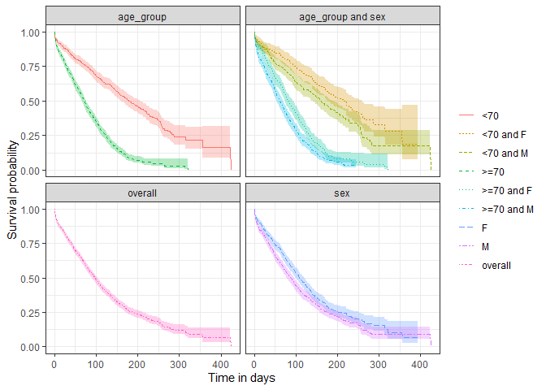

<!-- README.md is generated from README.Rmd. Please edit that file -->

# CohortSurvival 

[](https://CRAN.R-project.org/package=CohortSurvival)
[](https://codecov.io/github/darwin-eu/CohortSurvival?branch=main)
[](https://github.com/darwin-eu/CohortSurvival/actions)
[](https://lifecycle.r-lib.org/articles/stages.html)

CohortSurvival contains functions for extracting and summarising
survival data using the OMOP common data model.

## Installation

You can install the development version of CohortSurvival like so:

``` r
install.packages("remotes")
remotes::install_github("darwin-eu/CohortSurvival")
```

## Example usage

### Create a reference to data in the OMOP CDM format

The CohortSurvival package is designed to work with data in the OMOP CDM
format, so our first step is to create a reference to the data using the
CDMConnector package.

``` r
library(CDMConnector)
library(CohortSurvival)
library(dplyr)
library(ggplot2)
```

Creating a connection to a Postgres database would for example look
like:

``` r
con <- DBI::dbConnect(RPostgres::Postgres(),
  dbname = Sys.getenv("CDM5_POSTGRESQL_DBNAME"),
  host = Sys.getenv("CDM5_POSTGRESQL_HOST"),
  user = Sys.getenv("CDM5_POSTGRESQL_USER"),
  password = Sys.getenv("CDM5_POSTGRESQL_PASSWORD")
)

cdm <- CDMConnector::cdm_from_con(con,
  cdm_schema = Sys.getenv("CDM5_POSTGRESQL_CDM_SCHEMA"),
  write_schema = Sys.getenv("CDM5_POSTGRESQL_RESULT_SCHEMA")
)
```

### Example: MGUS

For this example we´ll use a cdm reference containing the MGUS2 dataset
from the survival package (which we transformed into a set of OMOP CDM
style cohort tables). The mgus2 dataset contains survival data of 1341
sequential patients with monoclonal gammopathy of undetermined
significance (MGUS). For more information see ´?survival::mgus2´

``` r
cdm <- CohortSurvival::mockMGUS2cdm()
```

In this example cdm reference we have three cohort tables of
interest: 1) MGUS diagnosis cohort

``` r
cdm$mgus_diagnosis %>%
  glimpse()
#> Rows: ??
#> Columns: 10
#> Database: DuckDB 0.8.1 [eburn@Windows 10 x64:R 4.2.1/:memory:]
#> $ cohort_definition_id <int> 1, 1, 1, 1, 1, 1, 1, 1, 1, 1, 1, 1, 1, 1, 1, 1, 1…
#> $ subject_id           <dbl> 1, 2, 3, 4, 5, 6, 7, 8, 9, 10, 11, 12, 13, 14, 15…
#> $ cohort_start_date    <date> 1981-01-01, 1968-01-01, 1980-01-01, 1977-01-01, …
#> $ cohort_end_date      <date> 1981-01-01, 1968-01-01, 1980-01-01, 1977-01-01, …
#> $ age                  <dbl> 88, 78, 94, 68, 90, 90, 89, 87, 86, 79, 86, 89, 8…
#> $ sex                  <fct> F, F, M, M, F, M, F, F, F, F, M, F, M, F, M, F, F…
#> $ hgb                  <dbl> 13.1, 11.5, 10.5, 15.2, 10.7, 12.9, 10.5, 12.3, 1…
#> $ creat                <dbl> 1.30, 1.20, 1.50, 1.20, 0.80, 1.00, 0.90, 1.20, 0…
#> $ mspike               <dbl> 0.5, 2.0, 2.6, 1.2, 1.0, 0.5, 1.3, 1.6, 2.4, 2.3,…
#> $ age_group            <chr> ">=70", ">=70", ">=70", "<70", ">=70", ">=70", ">…
```

2)  MGUS progression cohort

``` r
cdm$progression %>%
  glimpse()
#> Rows: ??
#> Columns: 4
#> Database: DuckDB 0.8.1 [eburn@Windows 10 x64:R 4.2.1/:memory:]
#> $ cohort_definition_id <int> 1, 1, 1, 1, 1, 1, 1, 1, 1, 1, 1, 1, 1, 1, 1, 1, 1…
#> $ subject_id           <dbl> 56, 81, 83, 111, 124, 127, 147, 163, 165, 167, 18…
#> $ cohort_start_date    <date> 1978-01-30, 1985-01-15, 1974-08-17, 1993-01-14, …
#> $ cohort_end_date      <date> 1978-01-30, 1985-01-15, 1974-08-17, 1993-01-14, …
```

3)  Death cohort

``` r
cdm$death_cohort %>%
  glimpse()
#> Rows: ??
#> Columns: 4
#> Database: DuckDB 0.8.1 [eburn@Windows 10 x64:R 4.2.1/:memory:]
#> $ cohort_definition_id <int> 1, 1, 1, 1, 1, 1, 1, 1, 1, 1, 1, 1, 1, 1, 1, 1, 1…
#> $ subject_id           <dbl> 1, 2, 3, 4, 5, 6, 7, 8, 10, 11, 12, 13, 14, 15, 1…
#> $ cohort_start_date    <date> 1981-01-31, 1968-01-26, 1980-02-16, 1977-04-03, …
#> $ cohort_end_date      <date> 1981-01-31, 1968-01-26, 1980-02-16, 1977-04-03, …
```

### MGUS diagnosis to death

We can get survival estimates for death following diagnosis like so:

``` r
MGUS_death <- estimateSingleEventSurvival(cdm,
  targetCohortTable = "mgus_diagnosis",
  targetCohortId = 1,
  outcomeCohortTable = "death_cohort",
  outcomeCohortId = 1
)

plotSurvival(MGUS_death)
```


### Stratified results

``` r
MGUS_death <- estimateSingleEventSurvival(cdm,
  targetCohortTable = "mgus_diagnosis",
  targetCohortId = 1,
  outcomeCohortTable = "death_cohort",
  outcomeCohortId = 1, 
  strata = list(c("age_group"),
                c("sex"),
                c("age_group", "sex"))
)

plotSurvival(MGUS_death, 
             colour = "strata_level", 
             facet= "strata_name")
```



### Summary statisitics on survival

For single event analyses, we can extract restricted mean survival and
median survival

``` r
survivalSummary(MGUS_death) %>% 
  tidyr::pivot_wider(names_from = "variable_type", values_from = "estimate") %>%
  dplyr::mutate("Median survival (95% CI)" = paste0(median_survival, " (", median_survival_95CI_lower, " to ", median_survival_95CI_higher, ")")
                ) %>% 
  dplyr::select(strata_name, strata_level, "Median survival (95% CI)")
#> # A tibble: 9 × 3
#>   strata_name       strata_level `Median survival (95% CI)`
#>   <chr>             <chr>        <chr>                     
#> 1 Overall           Overall      98 (92 to 103)            
#> 2 age_group         <70          180 (158 to 206)          
#> 3 age_group         >=70         71 (66 to 77)             
#> 4 sex               F            108 (100 to 121)          
#> 5 sex               M            88 (79 to 97)             
#> 6 age_group and sex <70 and F    215 (179 to 260)          
#> 7 age_group and sex <70 and M    158 (139 to 189)          
#> 8 age_group and sex >=70 and F   82 (75 to 94)             
#> 9 age_group and sex >=70 and M   61 (54 to 70)
```

## Estimating survival with competing risk

The package also allows to estimate survival of both an outcome and
competing risk outcome. We can then stratify, see information on events,
summarise the estimates and check the contributing participants in the
same way we did for the single event survival analysis.

``` r
MGUS_death_prog <- estimateCompetingRiskSurvival(cdm,
  targetCohortTable = "mgus_diagnosis",
  outcomeCohortTable = "progression",
  competingOutcomeCohortTable = "death_cohort"
)

plotCumulativeIncidence(MGUS_death_prog, 
                        colour = "outcome")
```


## Estimating survival with competing risk and strata

Similarly, we can ask for a competing risk survival and stratification
of the results by variables added previously to the cohort given. The
in-built function allows us to plot the results of the strata levels by
discarding the ones for the overall cohort.

``` r
MGUS_death_prog <-  estimateCompetingRiskSurvival(cdm,
  targetCohortTable = "mgus_diagnosis",
  outcomeCohortTable = "progression",
  competingOutcomeCohortTable = "death_cohort",
  strata = list(c("sex"))
)

plotCumulativeIncidence(MGUS_death_prog  %>%
                          dplyr::filter(strata_name != "Overall"), 
                        facet = "strata_level",
                        colour = "outcome")
```


### Disconnect from the cdm database connection

``` r
cdm_disconnect(cdm)
```
