# Single outcome event of interest

## Set up

Let us first load the packages required.

``` r
library(CDMConnector)
library(CohortSurvival)
library(dplyr)
library(ggplot2)
```

We will create a cdm reference containing our example MGUS2 survival
dataset. In practice you would use the CDMConnector package to connect
to your data mapped to the OMOP CDM.

``` r
cdm <- CohortSurvival::mockMGUS2cdm()
```

The mgus2 dataset contains survival data of 1341 sequential patients
with monoclonal gammopathy of undetermined significance (MGUS),
converted to the OMOP CDM from the one in the package `survival`. For
more information see
[`?survival::mgus2`](https://rdrr.io/pkg/survival/man/mgus2.html) .

In this vignette we will first estimate survival following a diagnosis
of MGUS, with death being our primary outcome of interest. In a study we
would typically need to first define study cohorts ourselves, before
starting the analysis, but in the case of our example data we already
have these cohorts available: `mgus_diagnosis` for our target cohort and
`death_cohort` for our outcome cohort.

In our target cohort we also have a number of additional features (age
or sex of the patients, for instance) recorded, which we will use for
stratification.

Let us first take a quick look at the data we will be working with:

``` r
cdm$mgus_diagnosis %>% 
  glimpse()
#> Rows: ??
#> Columns: 10
#> Database: DuckDB 1.4.2 [unknown@Linux 6.11.0-1018-azure:R 4.5.2/:memory:]
#> $ cohort_definition_id <int> 1, 1, 1, 1, 1, 1, 1, 1, 1, 1, 1, 1, 1, 1, 1, 1, 1…
#> $ subject_id           <int> 1, 2, 3, 4, 5, 6, 7, 8, 9, 10, 11, 12, 13, 14, 15…
#> $ cohort_start_date    <date> 1981-01-01, 1968-01-01, 1980-01-01, 1977-01-01, …
#> $ cohort_end_date      <date> 1981-01-01, 1968-01-01, 1980-01-01, 1977-01-01, …
#> $ age                  <dbl> 88, 78, 94, 68, 90, 90, 89, 87, 86, 79, 86, 89, 8…
#> $ sex                  <fct> F, F, M, M, F, M, F, F, F, F, M, F, M, F, M, F, F…
#> $ hgb                  <dbl> 13.1, 11.5, 10.5, 15.2, 10.7, 12.9, 10.5, 12.3, 1…
#> $ creat                <dbl> 1.30, 1.20, 1.50, 1.20, 0.80, 1.00, 0.90, 1.20, 0…
#> $ mspike               <dbl> 0.5, 2.0, 2.6, 1.2, 1.0, 0.5, 1.3, 1.6, 2.4, 2.3,…
#> $ age_group            <chr> ">=70", ">=70", ">=70", "<70", ">=70", ">=70", ">…

cdm$death_cohort %>% 
  glimpse()
#> Rows: ??
#> Columns: 4
#> Database: DuckDB 1.4.2 [unknown@Linux 6.11.0-1018-azure:R 4.5.2/:memory:]
#> $ cohort_definition_id <int> 1, 1, 1, 1, 1, 1, 1, 1, 1, 1, 1, 1, 1, 1, 1, 1, 1…
#> $ subject_id           <int> 1, 2, 3, 4, 5, 6, 7, 8, 10, 11, 12, 13, 14, 15, 1…
#> $ cohort_start_date    <date> 1981-01-31, 1968-01-26, 1980-02-16, 1977-04-03, …
#> $ cohort_end_date      <date> 1981-01-31, 1968-01-26, 1980-02-16, 1977-04-03, …
```

## Overall survival

To estimate survival we only need to call the
[`estimateSingleEventSurvival()`](https://darwin-eu.github.io/CohortSurvival/reference/estimateSingleEventSurvival.md)
function. This will give us all necessary results to assess the survival
of the whole target cohort. Note that the output of this function will
be in a `summarised_result` format. For more information on this type of
object, check [the
documentation](https://cran.r-project.org/package=omopgenerics/vignettes/summarised_result.html)
of the package `omopgenerics`.

This will allow us to use functions from other packages that work with
`summarised_result` objects, for instance, for plotting or visualising
our output.

Alternatively, we can convert the output to a more intuitive format if
we prefer to use other tools.

Let us first produce these overall results. Note that the minimal amount
of inputs necessary for this function are the `cdm` object and the names
of the target and outcome cohorts, which must be cohort tables in the
cdm provided.

``` r
MGUS_death <- estimateSingleEventSurvival(
  cdm,
  targetCohortTable = "mgus_diagnosis",
  outcomeCohortTable = "death_cohort"
)
MGUS_death %>% 
  glimpse()
#> Rows: 1,355
#> Columns: 13
#> $ result_id        <int> 1, 1, 1, 1, 1, 1, 1, 1, 1, 1, 1, 1, 1, 1, 1, 1, 1, 1,…
#> $ cdm_name         <chr> "mock", "mock", "mock", "mock", "mock", "mock", "mock…
#> $ group_name       <chr> "target_cohort", "target_cohort", "target_cohort", "t…
#> $ group_level      <chr> "mgus_diagnosis", "mgus_diagnosis", "mgus_diagnosis",…
#> $ strata_name      <chr> "overall", "overall", "overall", "overall", "overall"…
#> $ strata_level     <chr> "overall", "overall", "overall", "overall", "overall"…
#> $ variable_name    <chr> "outcome", "outcome", "outcome", "outcome", "outcome"…
#> $ variable_level   <chr> "death_cohort", "death_cohort", "death_cohort", "deat…
#> $ estimate_name    <chr> "estimate", "estimate_95CI_lower", "estimate_95CI_upp…
#> $ estimate_type    <chr> "numeric", "numeric", "numeric", "numeric", "numeric"…
#> $ estimate_value   <chr> "1", "1", "1", "0.9697", "0.9607", "0.9787", "0.9494"…
#> $ additional_name  <chr> "time", "time", "time", "time", "time", "time", "time…
#> $ additional_level <chr> "0", "0", "0", "1", "1", "1", "2", "2", "2", "3", "3"…
class(MGUS_death)
#> [1] "summarised_result" "omop_result"       "tbl_df"           
#> [4] "tbl"               "data.frame"
```

The main output is a `summarised_result` object with the usual columns.
All the information retrieved by the estimation process (estimates,
events, summary and attrition) is stored in the main output table,
`MGUS_death`, and its `settings` attribute provides information on the
different result types available. We can check this with the
[`settings()`](https://darwin-eu.github.io/omopgenerics/reference/settings.html)
function from `omopgenerics`.

``` r
settings(MGUS_death)
#> # A tibble: 4 × 17
#>   result_id result_type     package_name package_version group strata additional
#>       <int> <chr>           <chr>        <chr>           <chr> <chr>  <chr>     
#> 1         1 survival_proba… CohortSurvi… 1.0.2           targ… ""     "time"    
#> 2         2 survival_events CohortSurvi… 1.0.2           targ… ""     "time"    
#> 3         3 survival_summa… CohortSurvi… 1.0.2           targ… ""     ""        
#> 4         4 survival_attri… CohortSurvi… 1.0.2           targ… "reas… "reason_i…
#> # ℹ 10 more variables: min_cell_count <chr>, analysis_type <chr>,
#> #   censor_on_cohort_exit <chr>, competing_outcome <chr>, eventgap <chr>,
#> #   follow_up_days <chr>, minimum_survival_days <chr>, outcome <chr>,
#> #   outcome_date_variable <chr>, outcome_washout <chr>
```

An advantage of working with a `summarised_result` object is that we can
join these results with results from other packages like
`IncidencePrevalence` or `CohortCharacteristics` and view them all
together in a Shiny App.

The main visualisation functions in the package also work on this
`summarised_result` object. For instance, if we wish to plot the
survival estimates we can run the following line of code:

``` r
plotSurvival(MGUS_death)
```


We can also decide to add a basic risk table underneath the plot, by
setting the argument `riskTable = TRUE`.

``` r
plotSurvival(MGUS_death, riskTable = TRUE)
```


This plotting function has some other parameters which can be tuned. For
instance, we can plot the cumulative failure instead of the survival
probability by asking for `cumulativeFailure = TRUE`. You can check all
the plotting options in
[`?plotSurvival`](https://darwin-eu.github.io/CohortSurvival/reference/plotSurvival.md).

``` r
plotSurvival(MGUS_death, ribbon = FALSE)
```


``` r
plotSurvival(MGUS_death, cumulativeFailure = TRUE)
```

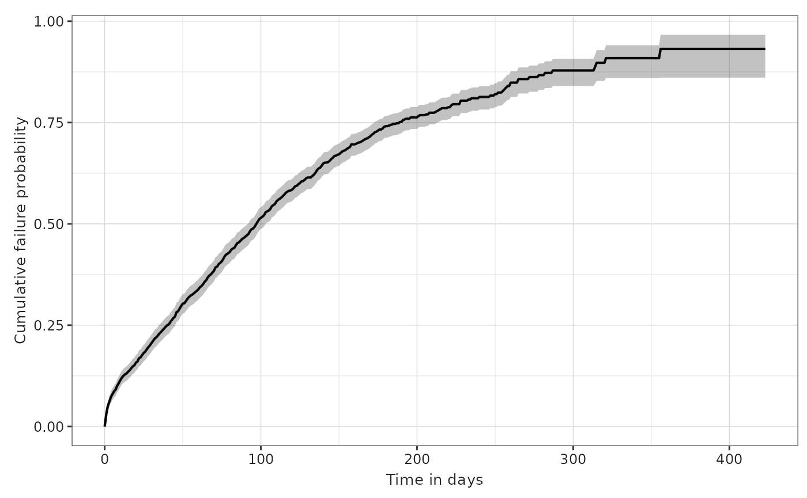

Because the output of the function `plotSurvival` is a ggplot, the user
can also change other aspects of the plot manually by adding ggplot
lines of code to the plot itself. For instance, we can switch the plot
axes:

``` r
plotSurvival(MGUS_death) + theme_bw() + ggtitle("Plot survival") + coord_flip()
```


If we want the time in the x axis in another unit (years or months), you
can use the parameter `timeScale` from the function:

``` r
plotSurvival(MGUS_death, timeScale = "years")
```

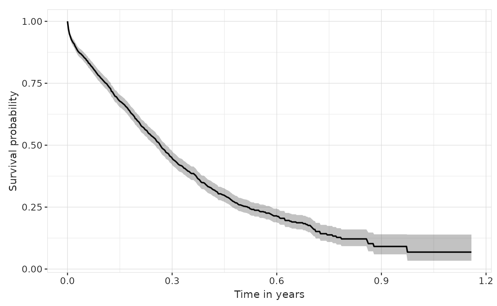

``` r
plotSurvival(MGUS_death, timeScale = "months")
```

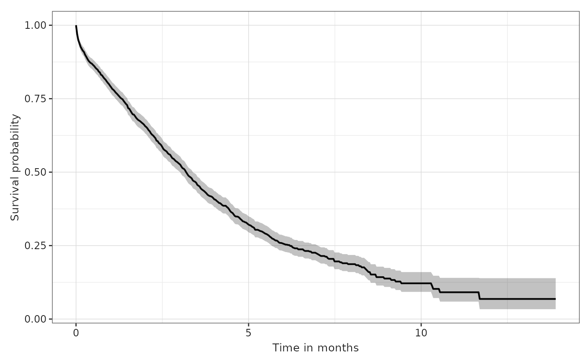

We could clearly do the same for any other time scaling. For months, we
would typically divide the estimates by 30.4375.

Apart from the survival estimates retrieved, our main output also
contains information on the survival events, summary and attrition.
There are different functions in the package which we can use to present
that information in a tidy way.

The function
[`tableSurvival()`](https://darwin-eu.github.io/CohortSurvival/reference/tableSurvival.md)
provides a survival summary. This includes the number of records (people
in the target cohort), the number of events (people who experience the
outcome event in the target cohort), and the median survival and
restricted mean survival if available. This is provided for all
combinations of target and outcome cohorts and stratifications available
in the result.

``` r
tableSurvival(MGUS_death)
```

[TABLE]

Note that if less than 50% of the people in the target cohort experience
the event, the median survival will not be reported (i.e. the output
will be `NA(NA,NA)`).

Note, additionally, that restricted mean survival is reported for the
whole study period (as long as follow up is available) by default,
unless asked otherwise. Therefore, `restrictedMeanFollowUp = NULL` will
provide this result for follow up as long as available. This parameter
can be changed in the main estimation function, if the user wants to. If
this parameter is set to a number greater than the follow up available,
the summary table will display `NA` for this value. For instance, if we
ask for a restricted mean follow up of 2 years in a target cohort that
we can only follow for 300 days, `tableSurvival` will report a
Restricted mean survival of `NA`.

This summary table function can also report survival at requested times.
For instance, we might want to know the survival estimates for the
cohort at 30, 90 and 180 days. We would do that as such:

``` r
tableSurvival(MGUS_death, times = c(30,90,180))
```

[TABLE]

If we ask for a survival estimate which is not available, the function
will not return it. For instance, in this case, follow up is not
available after 500 days, so:

``` r
tableSurvival(MGUS_death, times = c(30,90,180, 500))
```

[TABLE]

Other options of this table include giving the estimates in years
instead of days. Check
[`?tableSurvival`](https://darwin-eu.github.io/CohortSurvival/reference/tableSurvival.md)
for additional options included in the function parameters.

``` r
tableSurvival(MGUS_death, times = c(1,2), timeScale = "years")
```

[TABLE]

One of them is a special input called `.options`, which allows the user
to ask for a variety of additional formatting choices. To see the list
of options, we can call `optionsTableSurvival` :

``` r
optionsTableSurvival()
#> $decimals
#>    integer percentage    numeric proportion 
#>          0          2          2          2 
#> 
#> $decimalMark
#> [1] "."
#> 
#> $bigMark
#> [1] ","
#> 
#> $delim
#> [1] "\n"
#> 
#> $includeHeaderName
#> [1] TRUE
#> 
#> $includeHeaderKey
#> [1] TRUE
#> 
#> $na
#> [1] "–"
#> 
#> $title
#> NULL
#> 
#> $subtitle
#> NULL
#> 
#> $caption
#> NULL
#> 
#> $groupAsColumn
#> [1] FALSE
#> 
#> $groupOrder
#> NULL
#> 
#> $merge
#> [1] "all_columns"
```

So, for instance, if we want to add a title to the table and also change
the decimal mark to “,” and the big mark to “.”, we would call:

``` r
tableSurvival(MGUS_death, .options = list(title = "Survival summary",
                                          decimalMark = ",",
                                          bigMark = "."))
```

[TABLE]

Another function that provides tabular results is `riskTable`. We may
use it if we want a tidy presentation of the number of people at risk,
number of people experiencing an event, and number of people censored,
at all point of time available. Note that the timepoints will be the
ones provided by the estimation function, which is by default
`eventGap = 30`, so every 30 days. We can change that parameter at that
stage if we want aggregated events at a smaller or bigger interval.
Other options for this table are similar to the ones of `tableSurvival`.

``` r
riskTable(MGUS_death)
```

[TABLE]

## Survival format

If we are only working on a survival study, and we want to manually
inspect the result tables, we might want to put them in an easier format
to work with. Note, however, that the visualisation functions from this
package will not work with this new result format.

The function
[`asSurvivalResult()`](https://darwin-eu.github.io/CohortSurvival/reference/asSurvivalResult.md)
allows us to convert the result to a survival format, with the main
table containing the estimates and the information on events, summary
and attrition being stored as attributes.

``` r
# Transforming the output to a survival result format
MGUS_death_survresult <- MGUS_death %>% 
  asSurvivalResult() 
MGUS_death_survresult %>%
  glimpse()
#> Rows: 425
#> Columns: 10
#> $ cdm_name            <chr> "mock", "mock", "mock", "mock", "mock", "mock", "m…
#> $ target_cohort       <chr> "mgus_diagnosis", "mgus_diagnosis", "mgus_diagnosi…
#> $ outcome             <chr> "death_cohort", "death_cohort", "death_cohort", "d…
#> $ competing_outcome   <chr> "none", "none", "none", "none", "none", "none", "n…
#> $ variable            <chr> "death_cohort", "death_cohort", "death_cohort", "d…
#> $ time                <dbl> 0, 1, 2, 3, 4, 5, 6, 7, 8, 9, 10, 11, 12, 13, 14, …
#> $ result_type         <chr> "survival_probability", "survival_probability", "s…
#> $ estimate            <dbl> 1.0000, 0.9697, 0.9494, 0.9386, 0.9270, 0.9198, 0.…
#> $ estimate_95CI_lower <dbl> 1.0000, 0.9607, 0.9379, 0.9260, 0.9134, 0.9056, 0.…
#> $ estimate_95CI_upper <dbl> 1.0000, 0.9787, 0.9610, 0.9513, 0.9408, 0.9342, 0.…
# Events, attrition and summary are now attributes of the result object
attr(MGUS_death_survresult,"events") %>%
  glimpse()
#> Rows: 16
#> Columns: 10
#> $ cdm_name          <chr> "mock", "mock", "mock", "mock", "mock", "mock", "moc…
#> $ target_cohort     <chr> "mgus_diagnosis", "mgus_diagnosis", "mgus_diagnosis"…
#> $ outcome           <chr> "death_cohort", "death_cohort", "death_cohort", "dea…
#> $ competing_outcome <chr> "none", "none", "none", "none", "none", "none", "non…
#> $ variable          <chr> "death_cohort", "death_cohort", "death_cohort", "dea…
#> $ time              <dbl> 0, 30, 60, 90, 120, 150, 180, 210, 240, 270, 300, 33…
#> $ eventgap          <chr> "30", "30", "30", "30", "30", "30", "30", "30", "30"…
#> $ n_risk            <dbl> 1384, 1104, 895, 652, 438, 299, 187, 109, 61, 31, 16…
#> $ n_events          <dbl> 0, 285, 182, 167, 131, 86, 57, 20, 15, 11, 4, 3, 1, …
#> $ n_censor          <dbl> 0, 3, 27, 79, 74, 54, 54, 58, 33, 18, 10, 6, 3, 1, 1…
attr(MGUS_death_survresult,"summary") %>%
  glimpse()
#> Rows: 1
#> Columns: 25
#> $ cdm_name                            <chr> "mock"
#> $ target_cohort                       <chr> "mgus_diagnosis"
#> $ outcome                             <chr> "death_cohort"
#> $ competing_outcome                   <chr> "none"
#> $ variable                            <chr> "death_cohort"
#> $ number_records                      <dbl> 1384
#> $ n_events                            <dbl> 963
#> $ restricted_mean_survival            <dbl> 133
#> $ median_survival                     <dbl> 98
#> $ median_survival_95CI_lower          <dbl> 92
#> $ median_survival_95CI_higher         <dbl> 103
#> $ q0_survival                         <dbl> 0
#> $ q0_survival_95CI_lower              <dbl> 0
#> $ q0_survival_95CI_higher             <dbl> 0
#> $ q25_survival                        <dbl> 41
#> $ q25_survival_95CI_lower             <dbl> 35
#> $ q25_survival_95CI_higher            <dbl> 46
#> $ q75_survival                        <dbl> 189
#> $ q75_survival_95CI_lower             <dbl> 173
#> $ q75_survival_95CI_higher            <dbl> 214
#> $ q100_survival                       <dbl> 424
#> $ q100_survival_95CI_lower            <dbl> NA
#> $ q100_survival_95CI_higher           <dbl> NA
#> $ restricted_mean_survival_95CI_upper <dbl> 141
#> $ restricted_mean_survival_95CI_lower <dbl> 124
attr(MGUS_death_survresult,"attrition") %>%
  glimpse()
#> Rows: 12
#> Columns: 7
#> $ cdm_name          <chr> "mock", "mock", "mock", "mock", "mock", "mock", "moc…
#> $ target_cohort     <chr> "mgus_diagnosis_1", "mgus_diagnosis_1", "mgus_diagno…
#> $ outcome           <chr> "death_cohort", "death_cohort", "death_cohort", "dea…
#> $ competing_outcome <chr> "none", "none", "none", "none", "none", "none", "non…
#> $ reason            <chr> "Initial qualifying events", "Initial qualifying eve…
#> $ variable_name     <chr> "number_records", "number_subjects", "excluded_recor…
#> $ count             <int> 1384, 1384, 0, 0, 1384, 1384, 0, 0, 1384, 1384, 0, 0
```

We can now directly check all estimates for times 10 to 15, for
instance, like this:

``` r
MGUS_death_survresult %>%
  filter(time %in% c(10:15))
#> # A tibble: 6 × 10
#>   cdm_name target_cohort  outcome   competing_outcome variable  time result_type
#>   <chr>    <chr>          <chr>     <chr>             <chr>    <dbl> <chr>      
#> 1 mock     mgus_diagnosis death_co… none              death_c…    10 survival_p…
#> 2 mock     mgus_diagnosis death_co… none              death_c…    11 survival_p…
#> 3 mock     mgus_diagnosis death_co… none              death_c…    12 survival_p…
#> 4 mock     mgus_diagnosis death_co… none              death_c…    13 survival_p…
#> 5 mock     mgus_diagnosis death_co… none              death_c…    14 survival_p…
#> 6 mock     mgus_diagnosis death_co… none              death_c…    15 survival_p…
#> # ℹ 3 more variables: estimate <dbl>, estimate_95CI_lower <dbl>,
#> #   estimate_95CI_upper <dbl>
```

## Changing estimation parameters

So far we have seen how to estimate survival for the whole cohort with
the default settings, and how to easily inspect and present the results.

The main function,
[`estimateSingleEventSurvival()`](https://darwin-eu.github.io/CohortSurvival/reference/estimateSingleEventSurvival.md),
has many input parameters that we can change to provide results more
targeted to our needs. You can check all options, as usual, with
[`?estimateSingleEventSurvival`](https://darwin-eu.github.io/CohortSurvival/reference/estimateSingleEventSurvival.md).
We will comment on some of these options in this section.

By default, `outcomeWashout` is set to Inf, which means that we only
include people who have not had the outcome before index date (as
defined by their entry to the target cohort). We can change that and
ask, for instance, for people to only be excluded from the estimation
for a 30 day washout period instead. In this case, we would write
`estimateSingleEventSurvival(cdm, "mgus_diagnosis", "death_cohort", outcomeWashout = 30)`.

Other options include requiring a minimum number of survival days (the
default is set to `minimumSurvivalDays = 1`) or cutting the follow-up at
a certain amount of time (the default is set to `followUpDays = Inf`,
i.e. as much follow up as available).

We might want to retrieve event information at a smaller interval than
the default, which is every 30 days. Note that if we use the usual
exporting functions from `omopgenerics`, small numbers will be
suppressed. This can be changed, but it is likely that you cannot report
small counts anyway. Bigger intervals allow for aggregated counts which
tend to be bigger.

Note that if you need to specify the event gap you want in the plotting
function. If you change it in the estimation output, you will have to
change it in the plot accordingly (with either the same `eventGap`
number or a multiple, like we do in the following plot).

``` r
MGUS_death_gap7 <- estimateSingleEventSurvival(cdm, "mgus_diagnosis", "death_cohort", eventGap = 7)
plotSurvival(MGUS_death_gap7, riskTable = TRUE, riskInterval = 14)
```

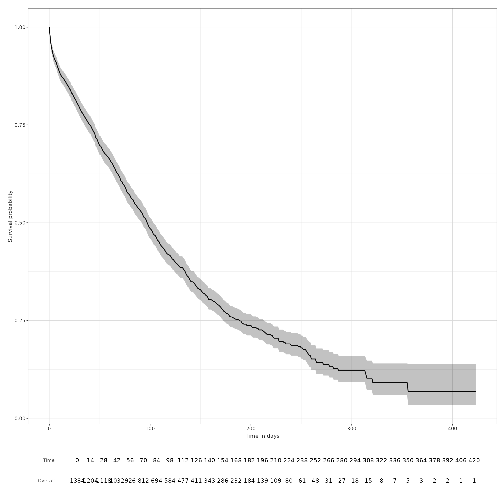

For all of these tweaks we need to run a separate analysis of survival,
i.e. each run allows for only one distinct input parameter, except for
the target and outcome cohorts. However, we can bind the results
together and both plotting and table functions will automatically
display all results with the required variables. Let us see that by
estimating survival with a specific date censoring.

``` r
MGUS_death_fu <- estimateSingleEventSurvival(
  cdm,
  targetCohortTable = "mgus_diagnosis",
  outcomeCohortTable = "death_cohort",
  followUpDays = 100
)

MGUS_death_all <- omopgenerics::bind(
  MGUS_death,
  MGUS_death_fu
)

MGUS_death_all %>%
  asSurvivalResult() %>%
  glimpse()
#> Rows: 526
#> Columns: 11
#> $ cdm_name            <chr> "mock", "mock", "mock", "mock", "mock", "mock", "m…
#> $ target_cohort       <chr> "mgus_diagnosis", "mgus_diagnosis", "mgus_diagnosi…
#> $ outcome             <chr> "death_cohort", "death_cohort", "death_cohort", "d…
#> $ competing_outcome   <chr> "none", "none", "none", "none", "none", "none", "n…
#> $ variable            <chr> "death_cohort", "death_cohort", "death_cohort", "d…
#> $ time                <dbl> 0, 1, 2, 3, 4, 5, 6, 7, 8, 9, 10, 11, 12, 13, 14, …
#> $ result_type         <chr> "survival_probability", "survival_probability", "s…
#> $ follow_up_days      <chr> "Inf", "Inf", "Inf", "Inf", "Inf", "Inf", "Inf", "…
#> $ estimate            <dbl> 1.0000, 0.9697, 0.9494, 0.9386, 0.9270, 0.9198, 0.…
#> $ estimate_95CI_lower <dbl> 1.0000, 0.9607, 0.9379, 0.9260, 0.9134, 0.9056, 0.…
#> $ estimate_95CI_upper <dbl> 1.0000, 0.9787, 0.9610, 0.9513, 0.9408, 0.9342, 0.…
```

Note that the survival result has an additional column `follow_up_days`,
as we would expect. Let us now see that both the `tableSurvival` and
`plotSurvival` functions display all required information.

``` r
plotSurvival(MGUS_death_all, facet = "follow_up_days")
```

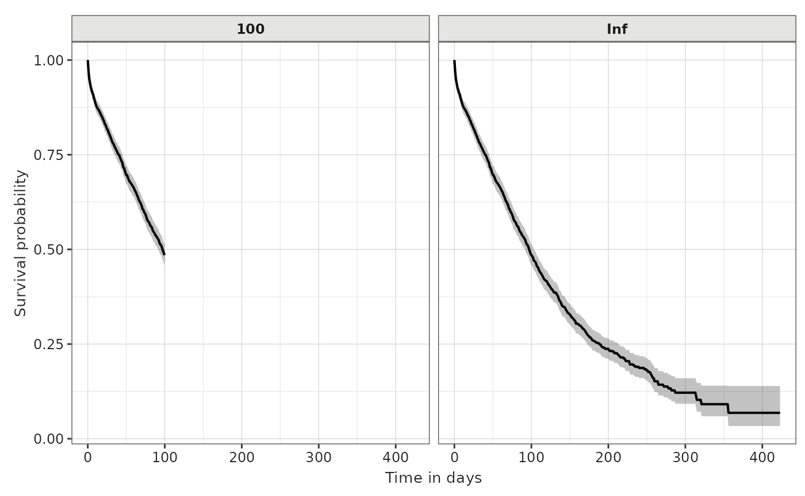

``` r

tableSurvival(MGUS_death_all)
```

[TABLE]

## With stratification

One of the most important parameters that we might be interested in
using is the `strata` one. To estimate survival for particular strata of
interest we need these features to have been added to the target cohort
table, as columns. Therefore, for instance, if we want to stratify our
estimation by sex, we need a column named `sex` with the necessary
information in the target cohort of interest.

In our mgus example, we already have a number of cohort characteristics
added to our diagnosis cohort. If we want to stratify by age group, by
sex, and by both at the same time, we would do the following:

``` r
MGUS_death_strata <- estimateSingleEventSurvival(cdm,
  targetCohortTable = "mgus_diagnosis",
  outcomeCohortTable = "death_cohort",
  strata = list(c("age_group"),
                c("sex"),
                c("age_group", "sex"))
) 
```

All the previous potential changes in other parameters, as well as the
different visualisation options, still apply in this case. Therefore, we
can get the summary table using `tableSurvival`, with now a row for each
strata:

``` r
tableSurvival(MGUS_death_strata)
```

[TABLE]

To plot the results property, we will have to specify faceting and
colouring options. One choice is to separate the plots into sex and
display different age groups in each one of them:

``` r
plotSurvival(MGUS_death_strata,
             facet = "sex",
             colour = "age_group")
```

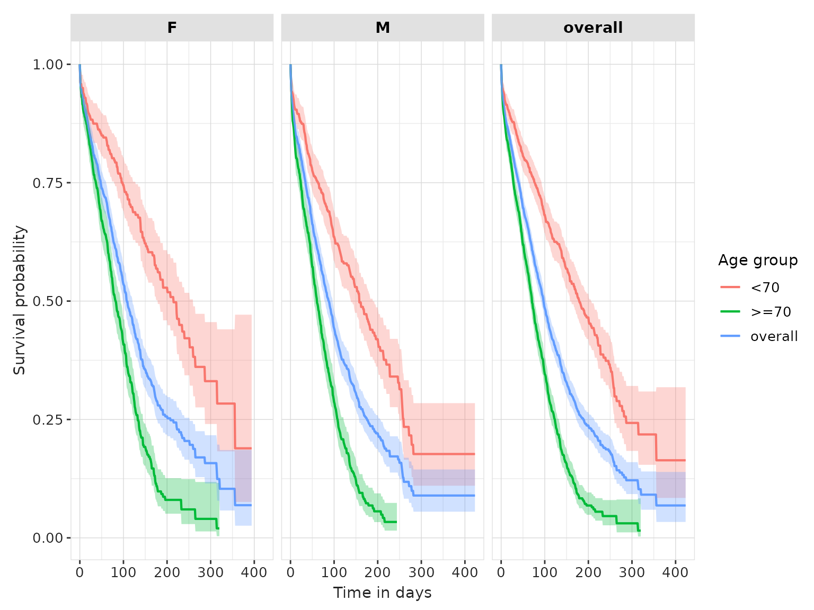

We can add the respective risk tables under each plot as well.

``` r
plotSurvival(MGUS_death_strata,
             colour = c("age_group", "sex"),
             riskTable = TRUE)
```

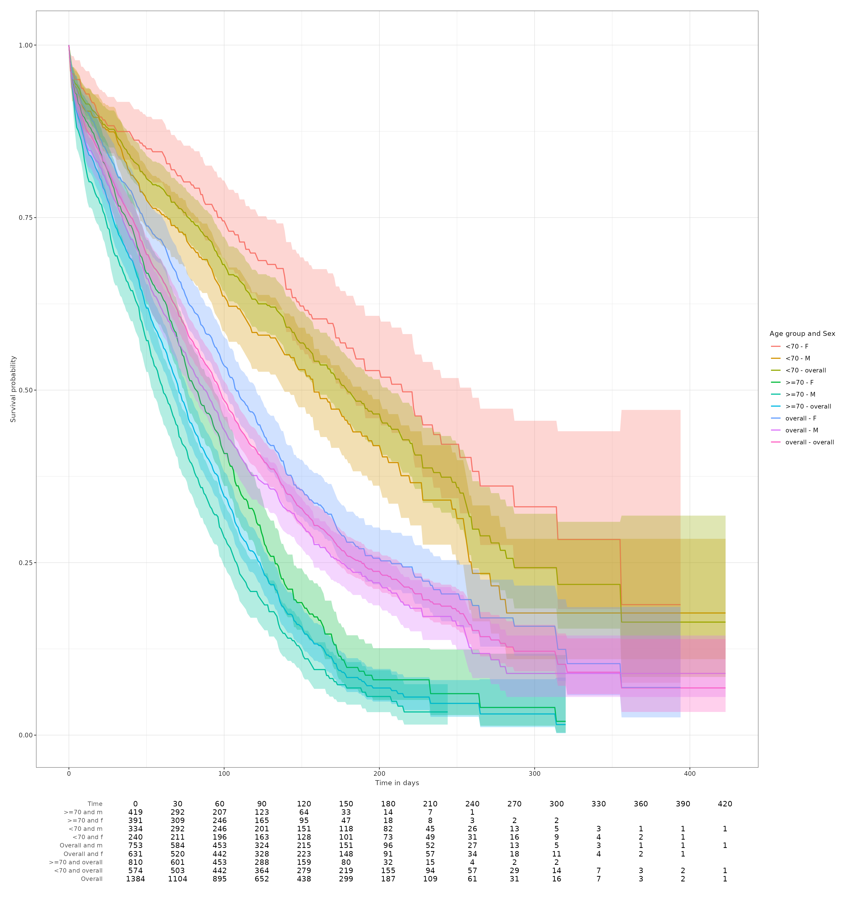

Because of the density of information in the tables, sometimes the
visualisation is not ideal. You might need to export the plot as an
image directly into your computer and specify a size big enough to
display the tables properly.

When facetting plots, the user can post-process the default graphic to
customise facets. Next we show the default facets obtained for
“age_group” and “sex” levels.

``` r
plotSurvival(MGUS_death_strata, facet = c("age_group", "sex"))
```

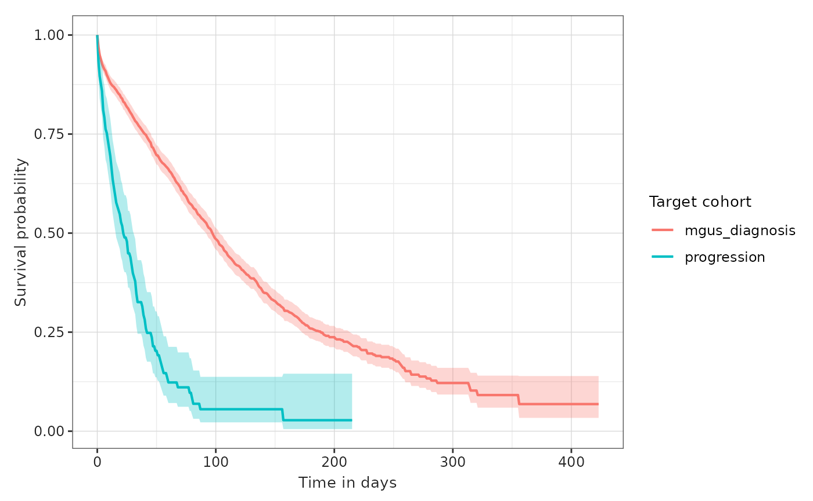

Next, we create customised facets by using functions from the ggplot2
package. We set “age_group” to columns and “sex” to rows:

``` r
plotSurvival(MGUS_death_strata) +
  facet_grid(rows = vars(sex), cols = vars(age_group))
```

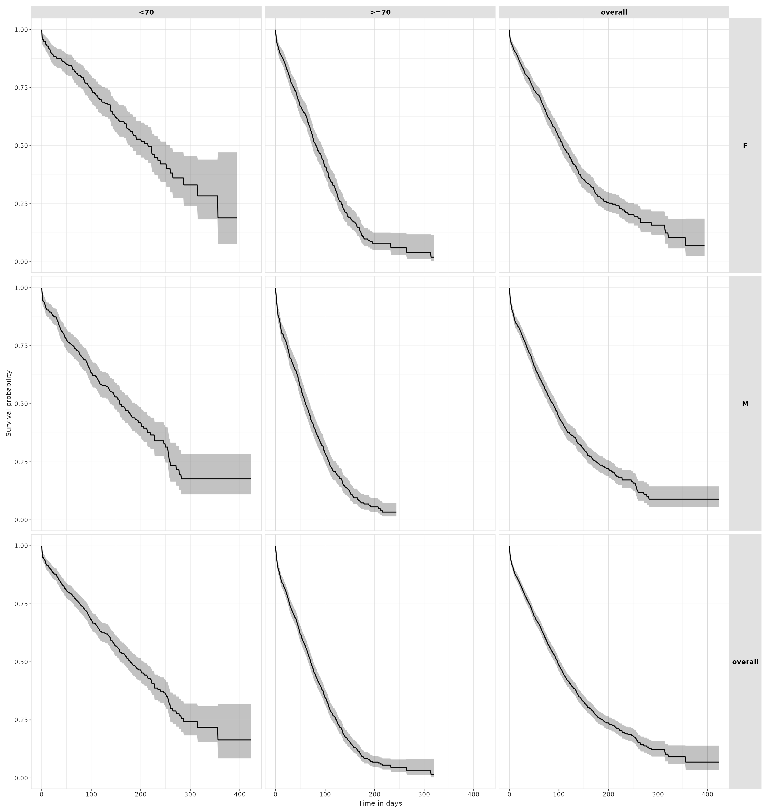

## Multiple target or outcome cohorts

Sometimes we might want to estimate survival of multiple targets and/or
outcomes. For the sake of this example, let us use the cohort of people
who are diagnosed with a progression to multiple myeloma, which we have
saved in our mgus2 dataset under the name `progression`, as an
additional target cohort. We can then use again the `death_cohort` as
the survival outcome.

The `estimateSingleSurvival` function does not allow different tables to
be passed for the target and outcome cohorts. If we have the additional
target in another table, like in our case, we will need to estimate
survival in a separate call and group the results a posteriori using the
function `bind` from `omopgenerics`:

``` r
MM_death <- estimateSingleEventSurvival(cdm, "progression", "death_cohort")
MGUS_MM_death <- bind(MGUS_death, MM_death)
```

The main output now has the information for both target cohorts, as we
can see in the settings table. We can check the summary table and plot
the estimates coloured by target cohort like this:

``` r
settings(MGUS_MM_death)
#> # A tibble: 4 × 17
#>   result_id result_type     package_name package_version group strata additional
#>       <int> <chr>           <chr>        <chr>           <chr> <chr>  <chr>     
#> 1         1 survival_proba… CohortSurvi… 1.0.2           targ… ""     "time"    
#> 2         2 survival_events CohortSurvi… 1.0.2           targ… ""     "time"    
#> 3         3 survival_summa… CohortSurvi… 1.0.2           targ… ""     ""        
#> 4         4 survival_attri… CohortSurvi… 1.0.2           targ… "reas… "reason_i…
#> # ℹ 10 more variables: min_cell_count <chr>, analysis_type <chr>,
#> #   censor_on_cohort_exit <chr>, competing_outcome <chr>, eventgap <chr>,
#> #   follow_up_days <chr>, minimum_survival_days <chr>, outcome <chr>,
#> #   outcome_date_variable <chr>, outcome_washout <chr>
tableSurvival(MGUS_MM_death)
```

[TABLE]

``` r
plotSurvival(MGUS_MM_death, colour = "target_cohort")
```

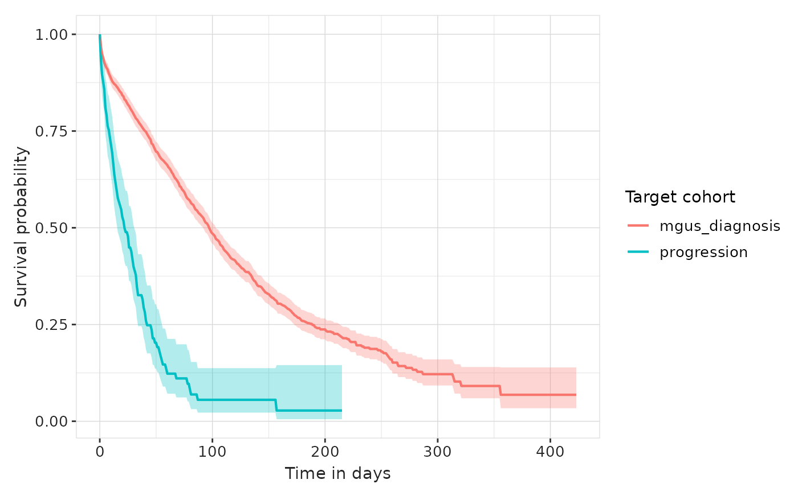

An alternative to running the estimation function twice is to have (or
create) a table with both target or outcome cohorts together, each one
with a different `cohort_definition_id`. Then,
`estimateSingleEventSurvival` will automatically run the estimation
process for all combinations of target and outcome cohorts available,
and produce independent results.

Imagine, in our case, that we want to estimate time to event for people
with a mgus diagnosis for both outcomes, progression to multiple myeloma
and death. We need to unite both outcome tables into one, which we can
do manually or using the function `bind` from `omopgenerics`:

``` r
cdm <- bind(cdm$progression, cdm$death_cohort, name = "outcome_cohorts")
```

Now we can use the new `outcome_cohorts` table as our outcome table and
we will get results for both analyses. Likewise, we can check the
summary and plot for both outcomes:

``` r
MGUS_death_prog <- estimateSingleEventSurvival(cdm, "mgus_diagnosis", "outcome_cohorts")
tableSurvival(MGUS_death_prog)
```

[TABLE]

``` r
plotSurvival(MGUS_death_prog, colour = "outcome")
```

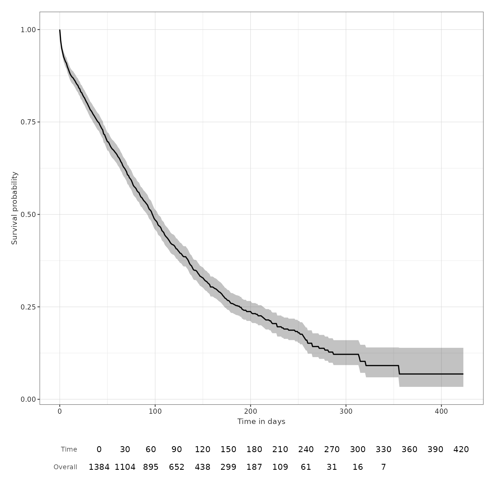

## Checking the assumption of proportionality between outcomes

If you want to test the proportional hazards assumption between outcomes
or across strata, you can use the `logLog` parameter in the survival
plot to visually assess the proportionality. With the aforementioned new
`outcome_cohorts` table of the two outcomes we can check this as such,
for `death` and `progression`:

``` r
plotSurvival(MGUS_death_prog, colour = "outcome", logLog = TRUE)
```

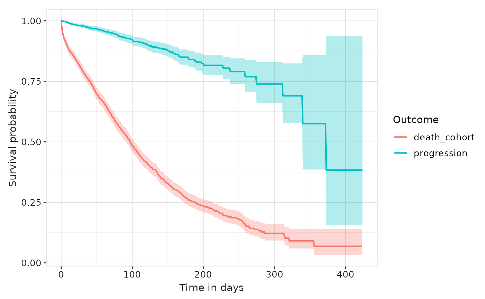

## Export and import a survival output

The survival output with all its attributes can be exported and imported
with the usual tools from `omopgenerics`, which are also available as
exportable functions in this package. Therefore, to export the main
output, with the usual parameters, we need to do the following:

``` r
x <- tempdir()
exportSummarisedResult(MGUS_death, path = x, fileName = "result.csv")
```

``` r
MGUS_death_imported <- importSummarisedResult(path = file.path(x, "result.csv"))
```

You can read more about exporting and importing `summarised_result`
objects
[here](https://cran.r-project.org/package=omopgenerics/vignettes/summarised_result.html).

Note that results are not suppressed at any point in `CohortSurvival` by
default. However, when exporting results with `exportSummarisedResult`,
any counts below 5 will be turned into `NA`. That can be changed with
the parameter `minCellCount`. If left as is, the suppression will be
done for small counts, as we can see by plotting the result after
exporting and importing. Note the difference between the following risk
table and the one we plotted at the beginning of this vignette:

``` r
plotSurvival(MGUS_death_imported, riskTable = TRUE)
```


## Disconnect from the cdm database connection

We finish by disconnecting from the cdm.

``` r
cdmDisconnect(cdm)
```
