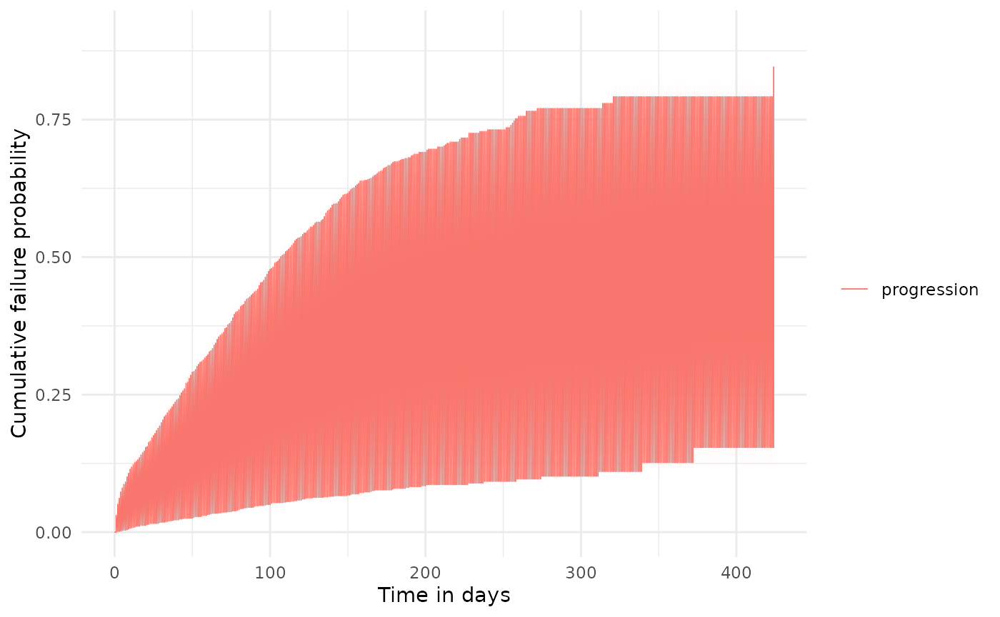
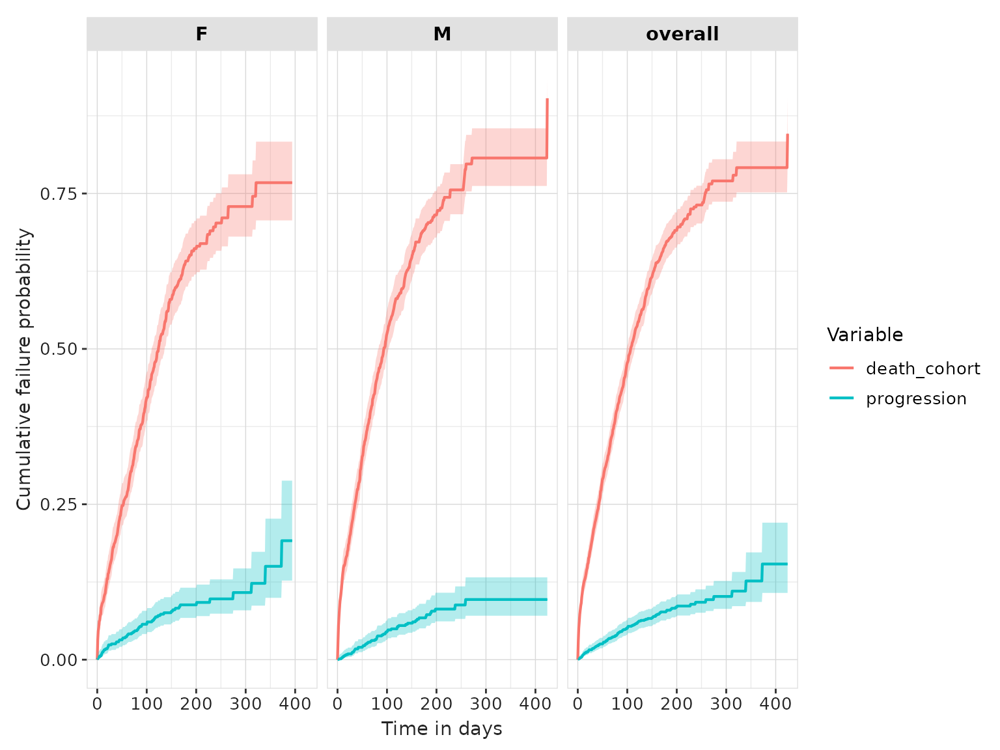

# Competing risk survival

## Set up

Let us first load the packages required.

``` r
library(CDMConnector)
library(CohortSurvival)
library(dplyr)
library(ggplot2)
```

We will create a cdm reference to use our example MGUS2 survival dataset
again. In practice you would use the CDMConnector package to connect to
your data mapped to the OMOP CDM.

``` r
cdm <- CohortSurvival::mockMGUS2cdm()
```

We will proceed as we did with the single event survival, but this time
we are considering an event of interest (progression of disease) with a
competing risk (mortality).

All the details provided in the single event survival vignette are also
valid in this study case: the potential input changes for the
estimation, the different output formats available or the options for
the table and plot functions. Everything discussed previously is also
applicable when adding a competing outcome, as we will show in this
vignette. Therefore we will not provide as much detail in all the
possible combinations of inputs here, but rather focus in the
particularities of estimating survival with an outcome and a competing
outcome.

Let us take a glimpse at the three cohorts we will use this time: the
mgus diagnosis as a target, and both the death cohort and the
progression to multiple myeloma as outcomes.

``` r
cdm$mgus_diagnosis |> 
  glimpse()
#> Rows: ??
#> Columns: 10
#> Database: DuckDB 1.4.2 [unknown@Linux 6.11.0-1018-azure:R 4.5.2/:memory:]
#> $ cohort_definition_id <int> 1, 1, 1, 1, 1, 1, 1, 1, 1, 1, 1, 1, 1, 1, 1, 1, 1…
#> $ subject_id           <int> 1, 2, 3, 4, 5, 6, 7, 8, 9, 10, 11, 12, 13, 14, 15…
#> $ cohort_start_date    <date> 1981-01-01, 1968-01-01, 1980-01-01, 1977-01-01, …
#> $ cohort_end_date      <date> 1981-01-01, 1968-01-01, 1980-01-01, 1977-01-01, …
#> $ age                  <dbl> 88, 78, 94, 68, 90, 90, 89, 87, 86, 79, 86, 89, 8…
#> $ sex                  <fct> F, F, M, M, F, M, F, F, F, F, M, F, M, F, M, F, F…
#> $ hgb                  <dbl> 13.1, 11.5, 10.5, 15.2, 10.7, 12.9, 10.5, 12.3, 1…
#> $ creat                <dbl> 1.30, 1.20, 1.50, 1.20, 0.80, 1.00, 0.90, 1.20, 0…
#> $ mspike               <dbl> 0.5, 2.0, 2.6, 1.2, 1.0, 0.5, 1.3, 1.6, 2.4, 2.3,…
#> $ age_group            <chr> ">=70", ">=70", ">=70", "<70", ">=70", ">=70", ">…

cdm$death_cohort |> 
  glimpse()
#> Rows: ??
#> Columns: 4
#> Database: DuckDB 1.4.2 [unknown@Linux 6.11.0-1018-azure:R 4.5.2/:memory:]
#> $ cohort_definition_id <int> 1, 1, 1, 1, 1, 1, 1, 1, 1, 1, 1, 1, 1, 1, 1, 1, 1…
#> $ subject_id           <int> 1, 2, 3, 4, 5, 6, 7, 8, 10, 11, 12, 13, 14, 15, 1…
#> $ cohort_start_date    <date> 1981-01-31, 1968-01-26, 1980-02-16, 1977-04-03, …
#> $ cohort_end_date      <date> 1981-01-31, 1968-01-26, 1980-02-16, 1977-04-03, …

cdm$progression |>
  glimpse()
#> Rows: ??
#> Columns: 4
#> Database: DuckDB 1.4.2 [unknown@Linux 6.11.0-1018-azure:R 4.5.2/:memory:]
#> $ cohort_definition_id <int> 1, 1, 1, 1, 1, 1, 1, 1, 1, 1, 1, 1, 1, 1, 1, 1, 1…
#> $ subject_id           <int> 56, 81, 83, 111, 124, 127, 147, 163, 165, 167, 18…
#> $ cohort_start_date    <date> 1978-01-30, 1985-01-15, 1974-08-17, 1993-01-14, …
#> $ cohort_end_date      <date> 1978-01-30, 1985-01-15, 1974-08-17, 1993-01-14, …
```

## Estimating survival with competing risk

This package allows to estimate survival of both an outcome and
competing risk outcome. We can then stratify, see information on events
or summarise the estimates, among others, in the same way we did for the
single event survival analysis. The only additional requirement here is
to specify the `competingOutcomeCohortTable` argument.

``` r
MGUS_death_prog <- estimateCompetingRiskSurvival(cdm,
  targetCohortTable = "mgus_diagnosis",
  outcomeCohortTable = "progression",
  competingOutcomeCohortTable = "death_cohort"
) 

MGUS_death_prog |> 
  asSurvivalResult() |> 
  glimpse()
#> Rows: 850
#> Columns: 10
#> $ cdm_name            <chr> "mock", "mock", "mock", "mock", "mock", "mock", "m…
#> $ target_cohort       <chr> "mgus_diagnosis", "mgus_diagnosis", "mgus_diagnosi…
#> $ outcome             <chr> "progression", "progression", "progression", "prog…
#> $ competing_outcome   <chr> "death_cohort", "death_cohort", "death_cohort", "d…
#> $ variable            <chr> "progression", "progression", "progression", "prog…
#> $ time                <dbl> 0, 1, 2, 3, 4, 5, 6, 7, 8, 9, 10, 11, 12, 13, 14, …
#> $ result_type         <chr> "survival_estimates", "survival_estimates", "survi…
#> $ estimate            <dbl> 0.0000, 0.0000, 0.0014, 0.0014, 0.0022, 0.0029, 0.…
#> $ estimate_95CI_lower <dbl> 0.0000, NA, 0.0004, 0.0004, 0.0007, 0.0011, 0.0015…
#> $ estimate_95CI_upper <dbl> 0.0000, NA, 0.0058, 0.0058, 0.0067, 0.0077, 0.0087…
```

As we can see above our results have been outputted in long format, once
transformed into the survival format. We can plot these results as we
did in the previous vignette:

``` r
plotSurvival(MGUS_death_prog, cumulativeFailure = TRUE,
             colour = "variable") + 
  theme(legend.position = "top")
```



The summary table of survival now has a row for each of the outcomes:

``` r
tableSurvival(MGUS_death_prog) 
```

[TABLE]

## With stratification

Again, to estimate survival for particular strata of interest we need
these features to have been added to the target cohort table. We can
them give the names of these strata columns to the estimating function
like so:

``` r
MGUS_death_prog <-  estimateCompetingRiskSurvival(cdm,
  targetCohortTable = "mgus_diagnosis",
  outcomeCohortTable = "progression",
  competingOutcomeCohortTable = "death_cohort",
  strata = list(c("sex"))
)
```

As well as results for each strata, we will always also have overall
results returned. We can filter the output table to plot only the
results for the different strata levels, if we do not wish to add the
overall cohort in the plot. We can also ask for the cumulative failure
probability to be plotted instead of the survival probability, which
makes more sense in the competing outcome case.

``` r
plotSurvival(MGUS_death_prog |> 
               dplyr::filter(strata_name != "Overall"), 
             facet = "sex",
             colour = "variable",
             cumulativeFailure = TRUE)
```



And we also now have summary statistics for each of the strata as well
as overall.

``` r
tableSurvival(MGUS_death_prog)
```

[TABLE]

## Disconnect from the cdm database connection

As always, we finish by disconnecting from the cdm.

``` r
cdmDisconnect(cdm)
```
