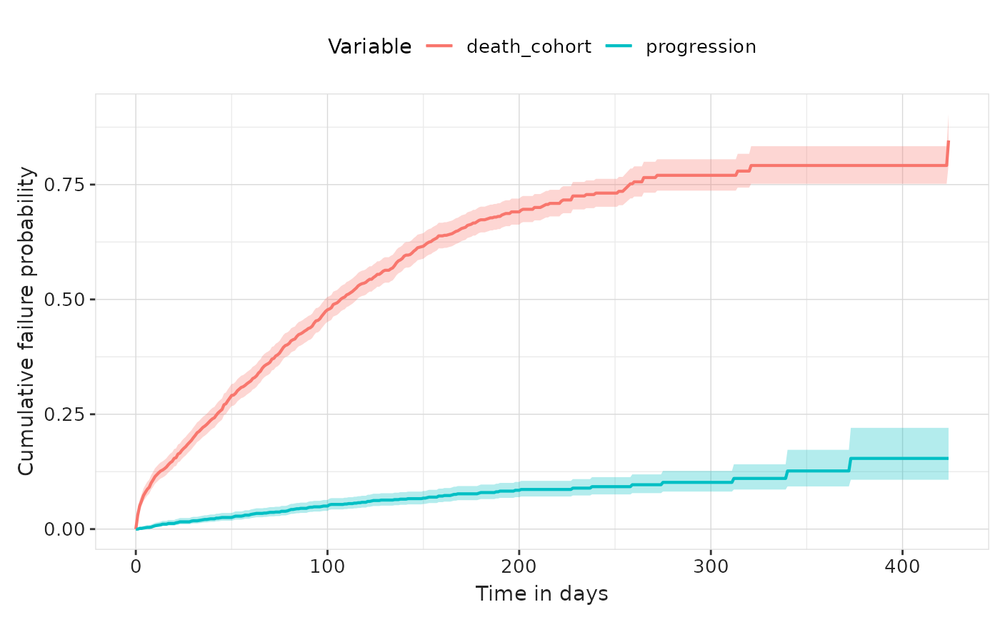
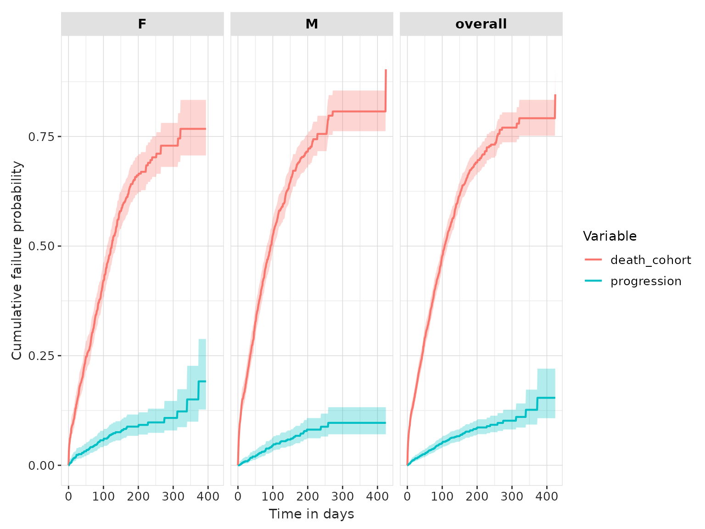

# Competing risk survival

## Set up

Let us first load the packages required.

``` r

library(CDMConnector)
library(CohortSurvival)
library(dplyr)
library(ggplot2)
```

We will create a cdm reference to use our example MGUS2 survival dataset
again. In practice you would use the CDMConnector package to connect to
your data mapped to the OMOP CDM.

``` r

cdm <- CohortSurvival::mockMGUS2cdm()
```

We will proceed as we did with the single event survival, but this time
we are considering an event of interest (progression of disease) with a
competing risk (mortality). A competing outcome is an event that changes
the interpretation of follow-up because, once it occurs, the event of
interest can no longer be observed in the same way. In this example,
death competes with later observed progression.

All the details provided in the single event survival vignette are also
valid in this study case: the potential input changes for the
estimation, the different output formats available or the options for
the table and plot functions. Everything discussed previously is also
applicable when adding a competing outcome, as we will show in this
vignette. Therefore we will not provide as much detail in all the
possible combinations of inputs here, but rather focus in the
particularities of estimating survival with an outcome and a competing
outcome.

Let us take a glimpse at the three cohorts we will use this time: the
mgus diagnosis as a target, and both the death cohort and the
progression to multiple myeloma as outcomes.

``` r

cdm$mgus_diagnosis |> 
  glimpse()
#> Rows: ??
#> Columns: 10
#> $ cohort_definition_id <int> 1, 1, 1, 1, 1, 1, 1, 1, 1, 1, 1, 1, 1, 1, 1, 1, 1…
#> $ subject_id           <int> 1, 2, 3, 4, 5, 6, 7, 8, 9, 10, 11, 12, 13, 14, 15…
#> $ cohort_start_date    <date> 1981-01-01, 1968-01-01, 1980-01-01, 1977-01-01, …
#> $ cohort_end_date      <date> 1981-01-01, 1968-01-01, 1980-01-01, 1977-01-01, …
#> $ age                  <dbl> 88, 78, 94, 68, 90, 90, 89, 87, 86, 79, 86, 89, 8…
#> $ sex                  <fct> F, F, M, M, F, M, F, F, F, F, M, F, M, F, M, F, F…
#> $ hgb                  <dbl> 13.1, 11.5, 10.5, 15.2, 10.7, 12.9, 10.5, 12.3, 1…
#> $ creat                <dbl> 1.30, 1.20, 1.50, 1.20, 0.80, 1.00, 0.90, 1.20, 0…
#> $ mspike               <dbl> 0.5, 2.0, 2.6, 1.2, 1.0, 0.5, 1.3, 1.6, 2.4, 2.3,…
#> $ age_group            <chr> ">=70", ">=70", ">=70", "<70", ">=70", ">=70", ">…

cdm$death_cohort |> 
  glimpse()
#> Rows: ??
#> Columns: 4
#> $ cohort_definition_id <int> 1, 1, 1, 1, 1, 1, 1, 1, 1, 1, 1, 1, 1, 1, 1, 1, 1…
#> $ subject_id           <int> 1, 2, 3, 4, 5, 6, 7, 8, 10, 11, 12, 13, 14, 15, 1…
#> $ cohort_start_date    <date> 1981-01-31, 1968-01-26, 1980-02-16, 1977-04-03, …
#> $ cohort_end_date      <date> 1981-01-31, 1968-01-26, 1980-02-16, 1977-04-03, …

cdm$progression |>
  glimpse()
#> Rows: ??
#> Columns: 4
#> $ cohort_definition_id <int> 1, 1, 1, 1, 1, 1, 1, 1, 1, 1, 1, 1, 1, 1, 1, 1, 1…
#> $ subject_id           <int> 56, 81, 83, 111, 124, 127, 147, 163, 165, 167, 18…
#> $ cohort_start_date    <date> 1978-01-30, 1985-01-15, 1974-08-17, 1993-01-14, …
#> $ cohort_end_date      <date> 1978-01-30, 1985-01-15, 1974-08-17, 1993-01-14, …
```

## Estimating survival with competing risk

This package allows to estimate the cumulative incidence of both an
outcome and a competing outcome. We can then stratify, see information
on events or summarise the estimates, among others, in the same way we
did for the single event survival analysis. The only additional
requirement here is to specify the `competingOutcomeCohortTable`
argument.

``` r

MGUS_death_prog <- estimateCompetingRiskSurvival(cdm,
  targetCohortTable = "mgus_diagnosis",
  outcomeCohortTable = "progression",
  competingOutcomeCohortTable = "death_cohort"
) 

MGUS_death_prog |> 
  asSurvivalResult() |> 
  glimpse()
#> Rows: 850
#> Columns: 10
#> $ cdm_name            <chr> "mock", "mock", "mock", "mock", "mock", "mock", "m…
#> $ target_cohort       <chr> "mgus_diagnosis", "mgus_diagnosis", "mgus_diagnosi…
#> $ outcome             <chr> "progression", "progression", "progression", "prog…
#> $ competing_outcome   <chr> "death_cohort", "death_cohort", "death_cohort", "d…
#> $ variable            <chr> "progression", "progression", "progression", "prog…
#> $ time                <dbl> 0, 1, 2, 3, 4, 5, 6, 7, 8, 9, 10, 11, 12, 13, 14, …
#> $ result_type         <chr> "survival_estimates", "survival_estimates", "survi…
#> $ estimate            <dbl> 0.0000, 0.0000, 0.0014, 0.0014, 0.0022, 0.0029, 0.…
#> $ estimate_95CI_lower <dbl> 0.0000, 0.0000, 0.0004, 0.0004, 0.0007, 0.0011, 0.…
#> $ estimate_95CI_upper <dbl> 0.0000, 0.0000, 0.0058, 0.0058, 0.0067, 0.0077, 0.…
```

As we can see above our results have been outputted in long format, once
transformed into the survival format. For competing-risk results,
`estimate` is interpreted as cumulative incidence for the row’s
`variable`, which will be either the outcome of interest or the
competing outcome. This is why we use `cumulativeFailure = TRUE` when
plotting:

``` r

plotSurvival(MGUS_death_prog, cumulativeFailure = TRUE,
             colour = "variable") + 
  theme(legend.position = "top")
```



The summary table of survival now has a row for each of the outcomes:

``` r

tableSurvival(MGUS_death_prog) 
```

[TABLE]

The restricted mean summary follows the same principle as in the
single-event analysis: it is calculated up to `restrictedMeanFollowUp`.
If `restrictedMeanFollowUp = NULL`, the horizon is left to the
underlying survival summary. In stratified analyses, this can use a
common maximum follow-up time across the fitted curves. A stratum with
shorter observed follow-up may therefore have its last estimate carried
forward and integrated beyond its own maximum follow-up. This can make
restricted mean summaries larger than the observed follow-up time for
some strata and can make comparisons misleading. For comparisons, set a
common clinically meaningful horizon in
[`estimateCompetingRiskSurvival()`](https://darwin-eu.github.io/CohortSurvival/reference/estimateCompetingRiskSurvival.md)
that is supported by follow-up in all groups, for example
`restrictedMeanFollowUp = 365`.

The outcome and competing outcome can have separate washout definitions.
`outcomeWashout` controls prior events of the outcome of interest, while
`competingOutcomeWashout` controls prior competing events. In both
cases, `Inf` means any prior event before target cohort entry and `0`
means no pre-index washout. Other censoring parameters, such as
`followUpDays`, `censorOnCohortExit`, and `censorOnDate`, behave as in
the single-event setting.

## With stratification

Again, to estimate survival for particular strata of interest we need
these features to have been added to the target cohort table. We can
then give the names of these strata columns to the estimating function
like so:

``` r

MGUS_death_prog <-  estimateCompetingRiskSurvival(cdm,
  targetCohortTable = "mgus_diagnosis",
  outcomeCohortTable = "progression",
  competingOutcomeCohortTable = "death_cohort",
  strata = list(c("sex"))
)
```

As well as results for each strata, we will always also have overall
results returned. We can filter the output table to plot only the
results for the different strata levels, if we do not wish to add the
overall cohort in the plot. We can also ask for the cumulative failure
probability to be plotted instead of the survival probability, which
makes more sense in the competing outcome case.

``` r

plotSurvival(MGUS_death_prog |> 
               dplyr::filter(strata_name != "Overall"), 
             facet = "sex",
             colour = "variable",
             cumulativeFailure = TRUE)
```



And we also now have summary statistics for each of the strata as well
as overall.

``` r

tableSurvival(MGUS_death_prog)
```

[TABLE]

## Disconnect from the cdm database connection

As always, we finish by disconnecting from the cdm.

``` r

cdmDisconnect(cdm)
```
